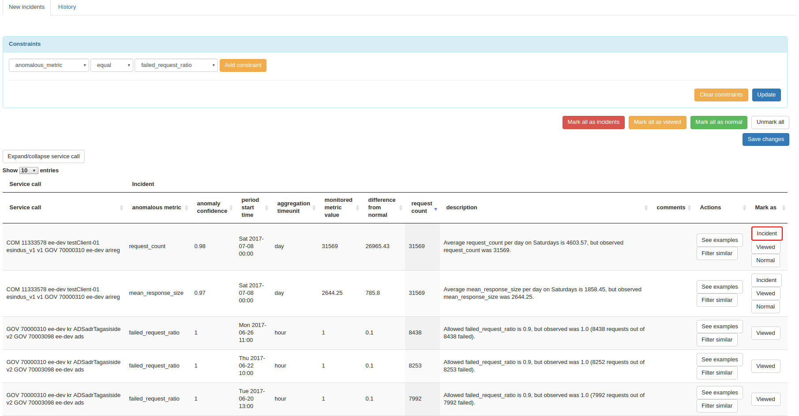
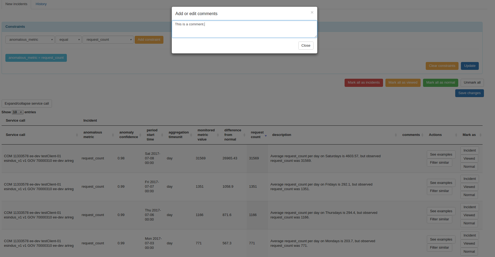
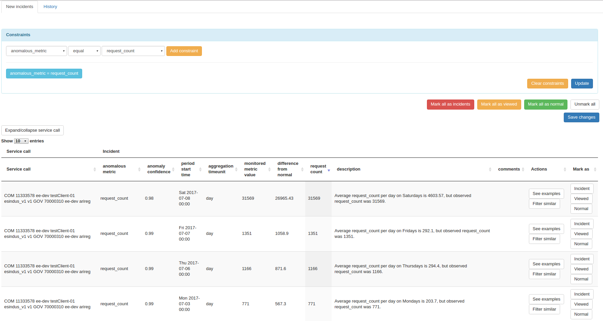
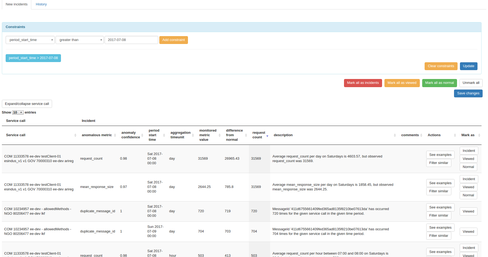
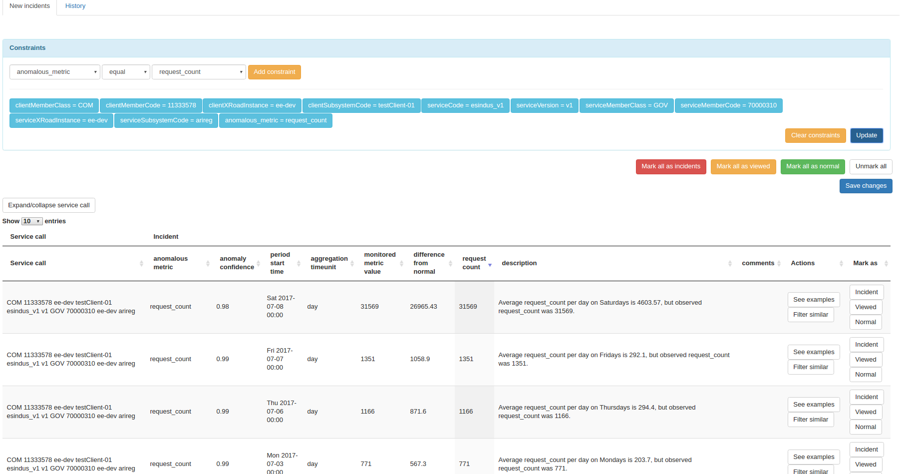
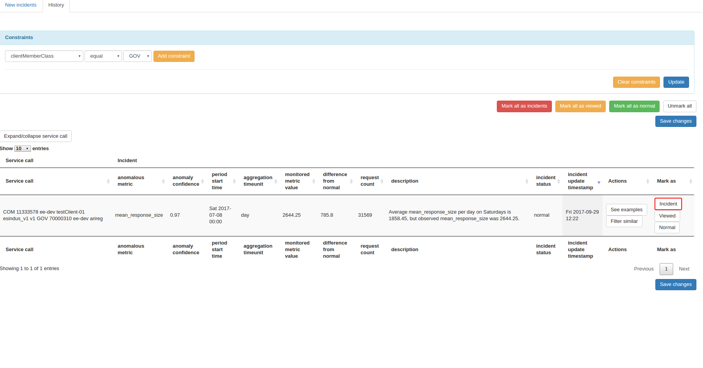

|  |  |
| :-------------------------------------------------- | -------------------------: |

# Analysis Module

# Usage Manual

## 1. Marking the status of anomalies

### Mark a single anomaly's status as incident

To mark the status of a single anomaly as `incident`:
1. Click the button `Incident` in the column `Mark as` in the table row of the given anomaly.
2. Click the button `Save changes`.

### Mark the status of all anomalies in a page as Normal

To mark the status of all anomalies in the active page as `normal`:
1. Click the button `Mark all as normal` above the table.
2. Click the button `Save changes`.

### Additional information

The status of anomaly types `request_count, mean_response_size, mean_request_size, mean_client_duration, mean_producer_duration` can be marked as:
1. `normal` - the reported anomaly reflects behaviour that is actually normal
2. `incident` - the reported anomaly is, indeed, an incident
3. `viewed` - can be used to mark the anomaly as reviewed (it will be moved to the `History` tab), but no decision about the status should be made

The status of anomaly types `failed_request_ratio, duplicate_message_id, requestNwDuration, responseNwDuration` can be marked as:
1. `viewed` - can be used to mark the anomaly as reviewed (it will be moved to the `History` tab)

The user can mark the status of any number of anomalies on the given page. To save the changes, the button `Save changes` (either on top of the table or on the bottom) should be pressed. If changes were successfully made, the number of updated incidents will be shown to the user.

## 2. Adding a comment to an incident

To add a comment to an incident: 
1. Click the (possibly empty) table cell in the column `comments` in the table row of the given anomaly.
2. In the pop-up window, write the comments.
3. Press `Close` to close the pop-up window.
4. Click the button `Save changes`.

## 3. Filtering anomalies

### Filter request_count anomalies

In the Constraints module above the table,
1. select `anomalous_metric` in the first drop-down selector,
2. select `equal` in the second drop-down selector,
3. select `request_count` in the third drop-down selector,
4. press `Add constraint` button,
5. press `Update` button.

### Filter anomalies that include requests starting from 2017-07-08

In the Constraints module above the table,
1. select `period_start_time` in the first drop-down selector,
2. select `greater than` in the second drop-down selector,
3. write `2017-07-08` in the following text input field,
4. press `Add constraint` button,
5. press `Update` button.

### Filter anomalies having the same Service call and anomaly type as another anomaly currently presented in the table 

To filter similar anomalies,
1. In the table, press the `Filter similar` button in the relevant row. Several blue `constraints` appear in the Constraints module.
2. In the Constraints module, press on all the `constraints` that are irrelevant for the desired filter (all except the ones related to service call and anomalous_metric).
3. Press `Update` button.

## 4. Update an anomaly whose status has already been marked as normal

To change the status of an already modified anomaly:
1. On top of the page, click on the `History` tab.
2. Select `Incident` in the `Mark as` column in the relevant table row.
3. Press `Save changes` button.

