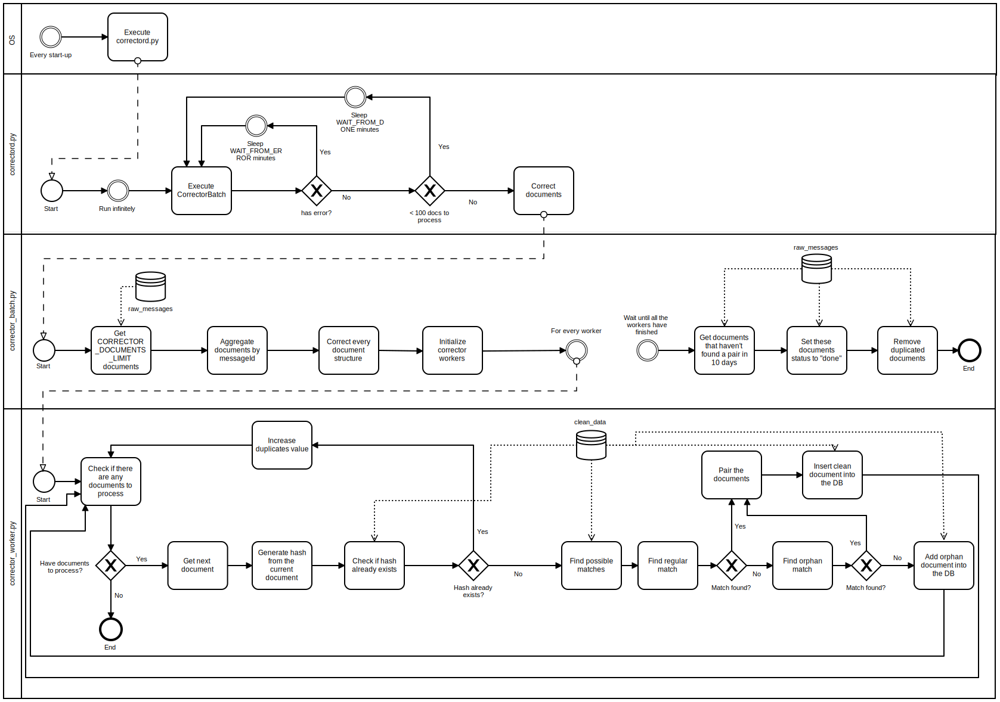

| [](https://www.ria.ee/en/) [](https://www.ria.ee/en/x-road.html) |  |
| :-------------------------------------------------- | -------------------------: |

# X-Road v6 monitor project - Corrector Module

## About

The **Corrector module** is part of [X-Road v6 monitor project](../README.md), which includes modules of [Database module](database_module.md), [Collector module](collector_module.md), Corrector module (this document), [Analysis module](analysis_module.md), [Reports module](reports_module.md), [Opendata module](opendata_module.md) and [Networking/Visualizer module](networking_module.md).

The **Corrector module** is responsible to clean the raw data from corrector and derive monitoring metrics in a clean database collection. The execution of the corrector module is performed automatically via a **service** task.

It is important to note that it can take up to 7 days for the [Collector module](collector_module.md) to receive X-Road v6 operational data from (all available) security server(s) and up to 3 days for the Corrector_module to clean the raw data and derive monitoring metrics in a clean database collection.

Overall system, its users and rights, processes and directories are designed in a way, that all modules can reside in one server (different users but in same group 'opmon') but also in separate servers. 

Overall system is also designed in a way, that allows to monitor data from different X-Road v6 instances (in Estonia `ee-dev`, `ee-test`, `EE`, see also [X-Road v6 environments](https://www.ria.ee/en/x-road-environments.html#v6).

Overall system is also designed in a way, that can be used by X-Road Centre for all X-Road members as well as for Member own monitoring (includes possibilities to monitor also members data exchange partners).

The module source code can be found at:

```
https://github.com/ria-ee/X-Road-opmonitor
```

and can be downloaded into server:

```bash
sudo su - corrector
# If HOME not set, set it to /tmp default.
export TMP_DIR=${HOME:=/tmp}
export PROJECT="X-Road-opmonitor"
export PROJECT_URL="https://github.com/ria-ee/${PROJECT}.git"
export SOURCE="${TMP_DIR}/${PROJECT}"
if [ ! -d "${TMP_DIR}/${PROJECT}" ]; then \
    cd ${TMP_DIR}; git clone ${PROJECT_URL}; \
else \
  cd ${SOURCE}; git pull ${PROJECT_URL}; \
fi
```

## Diagram



## Pair matching logic
The first step is to add the missing fields into the document (in case it is missing some). 
The value will be "None" for the missing fields. 
The fields that MUST be there for each document are the following:

```
'monitoringDataTs', 'securityServerInternalIp', 'securityServerType', 'requestInTs', 'requestOutTs',
'responseInTs', 'responseOutTs', 'clientXRoadInstance', 'clientMemberClass', 'clientMemberCode',
'clientSubsystemCode', 'serviceXRoadInstance', 'serviceMemberClass', 'serviceMemberCode',
'serviceSubsystemCode', 'serviceCode', 'serviceVersion', 'representedPartyClass', 'representedPartyCode',
'messageId', 'messageUserId', 'messageIssue', 'messageProtocolVersion', 'clientSecurityServerAddress',
'serviceSecurityServerAddress', 'requestSoapSize', 'requestMimeSize', 'requestAttachmentCount',
'responseSoapSize', 'responseMimeSize', 'responseAttachmentCount', 'succeeded', 'soapFaultCode',
'soapFaultString'
```

Before finding a match, a hash is calculated for the current document. The following fields are included:

```
'monitoringDataTs', 'securityServerInternalIp', 'securityServerType', 'requestInTs', 
‘requestOutTs', 'responseInTs', 'responseOutTs', 'clientXRoadInstance', 'clientMemberClass', 
'clientMemberCode', 'clientSubsystemCode', 'serviceXRoadInstance', 'serviceMemberClass', 
'serviceMemberCode', 'serviceSubsystemCode', 'serviceCode', 'serviceVersion', 
'representedPartyClass', 'representedPartyCode', 'messageId', 'messageUserId', 
'messageIssue', 'messageProtocolVersion', 'clientSecurityServerAddress', 
'serviceSecurityServerAddress', 'requestSoapSize', 'requestMimeSize', 
‘requestAttachmentCount', 'responseSoapSize', 'responseMimeSize', ‘responseAttachmentCount', 
'succeeded', 'soapFaultCode', 'soapFaultString'
```

The fields excluded from the hash are the following:

```
'_id', 'insertTime' 'corrected'
```

After calculating the hash it is checked that the hash doesn't already exist in the DB (clean_data). 
If it does exist, the document is skipped.

If the hash doesn't exist, then possible matches are queried for the document.
The possible matches are queried using the following rules:
* 'messageId' == currentDocument's messageId'
* 'correctorStatus' == 'processing'
* (currentDoc's 'requestInTs' - 60s) <= 'requestInTs' <= (currentDoc's 'requestInTs' + 60s)
* If the current document's 'securityServerType' == 'Client' then we query only the documents that have 'clientHash' == None
* If the current document's 'securityServerType' == 'Producer' then we query only the documents that have 'producerHash' == None

Then all the possible candidates will be first matched using regular match to make up the pair.
The 'requestInTs' time difference must be <= 60 seconds for BOTH the regular and orphan match.
The fields that must be equal for regular match are the following:

```
'clientMemberClass', 'requestMimeSize', 'serviceSubsystemCode', 'requestAttachmentCount',
'serviceSecurityServerAddress', 'messageProtocolVersion', 'responseSoapSize', 'succeeded',
'clientSubsystemCode', 'responseAttachmentCount', 'serviceMemberClass', 'messageUserId',
'serviceMemberCode', 'serviceXRoadInstance', 'clientSecurityServerAddress', 'clientMemberCode',
'clientXRoadInstance', 'messageIssue', 'serviceVersion', 'requestSoapSize', 'serviceCode',
'representedPartyClass', 'representedPartyCode', 'soapFaultCode', 'soapFaultString',
'responseMimeSize', 'messageId'
```

If no match is found, then the orphan match will be used.
The fields that must be equal for orphan match are the following:

```
'clientMemberClass', 'serviceSubsystemCode', 'serviceSecurityServerAddress', 'messageProtocolVersion', 'succeeded',
'clientSubsystemCode', 'serviceMemberClass', 'messageUserId', 'serviceMemberCode', 'serviceXRoadInstance',
'clientSecurityServerAddress', 'clientMemberCode', 'clientXRoadInstance', 'messageIssue', 'serviceVersion',
'serviceCode', 'representedPartyClass', 'representedPartyCode', 'soapFaultCode', 'soapFaultString', 'messageId'
```

If still no match found then the document will be added into the clean_data as "orphan".
If the match was found then the documents will be paired and added into the clean_data as either "regular_pair" or "orphan_pair".

## Networking

### Outgoing

The corrector module needs access to the Database Module (see ==> [Database_Module](database_module.md) <==).

### Incoming

No **incoming** connection is needed in the corrector module.

## Installation

This sections describes the necessary steps to install the **corrector module** in a Linux Ubuntu 16.04. 
To a complete overview of different modules and machines, please refer to the ==> [System Architecture](system_architecture.md) <== documentation.

### Install required packages

To install the necessary packages, execute the following commands:

```bash
sudo apt-get update
sudo apt-get install python3-pip
sudo pip3 install pymongo==3.4.0
```
Most libraries follow the "MAJOR.MINOR.PATCH" schema, so the guideline is to review and update PATCH versions always (they mostly contain bug fixes). MINOR updates can be applied,  as they should keep compatibility, but there is no guarantee for some libraries. A suggestion would be to check if tests are working after MINOR updates and rollback if they stop working. MAJOR updates should not be applied.

### Install corrector module

The corrector module uses the system user **corrector** and group **opmon**. To create them, execute:

```bash
sudo useradd --base-dir /opt --create-home --system --shell /bin/bash --gid corrector corrector
sudo groupadd --force opmon
sudo usermod --append --groups opmon corrector
```

The module files should be installed in the APPDIR directory, within a sub-folder named after the desired X-Road instance. 
In this manual, `/srv/app` is used as APPDIR and the `sample` is used as INSTANCE (please change `sample` to map your desired instance).

```bash
export APPDIR="/srv/app"
export INSTANCE="sample"
# Create log and heartbeat directories with group 'opmon' write permission
sudo mkdir --parents ${APPDIR}/${INSTANCE}
sudo mkdir --parents ${APPDIR}/${INSTANCE}/logs
sudo mkdir --parents ${APPDIR}/${INSTANCE}/heartbeat
sudo chown root:opmon ${APPDIR}/${INSTANCE} ${APPDIR}/${INSTANCE}/logs ${APPDIR}/${INSTANCE}/heartbeat
sudo chmod g+w ${APPDIR}/${INSTANCE} ${APPDIR}/${INSTANCE}/logs ${APPDIR}/${INSTANCE}/heartbeat
```

Copy the **corrector** code to the install folder and fix the file permissions:

```bash
# export APPDIR="/srv/app"; export INSTANCE="sample"
sudo cp --recursive --preserve ${SOURCE}/corrector_module ${APPDIR}/${INSTANCE}
```

Settings for different X-Road instances have been prepared and can be used:

```bash
# export APPDIR="/srv/app"; export INSTANCE="sample"
sudo rm ${APPDIR}/${INSTANCE}/corrector_module/settings.py
sudo ln --symbolic \
    ${APPDIR}/${INSTANCE}/corrector_module/settings_${INSTANCE}.py  \
	${APPDIR}/${INSTANCE}/corrector_module/settings.py
```

If needed, edit necessary modifications to the settings file using your favorite text editor (here, **vi** is used):

```bash
# export APPDIR="/srv/app"; export INSTANCE="sample"
sudo vi ${APPDIR}/${INSTANCE}/corrector_module/settings.py
```

Correct necessary permissions

```bash
# export APPDIR="/srv/app"; export INSTANCE="sample"
sudo chown --recursive corrector:corrector ${APPDIR}/${INSTANCE}/corrector_module
sudo chmod --recursive -x+X ${APPDIR}/${INSTANCE}/corrector_module
find  ${APPDIR}/${INSTANCE}/corrector_module/ -name '*.sh' -type f | sudo xargs chmod u+x
```

Prepare system service to run corrector module with:

```bash
# export INSTANCE="sample"
sudo vi /lib/systemd/system/corrector_${INSTANCE}.service
```

Add the following content (replace APPDIR `/srv/app` to map your desired application directory and INSTANCE `sample` to map your desired instance):

```
[Unit]
Description=Corrector Service sample
After=multi-user.target

[Service]
User=corrector
Group=opmon
WorkingDirectory=/srv/app/sample/
ExecStart=/usr/bin/python3 /srv/app/sample/corrector_module/correctord.py

[Install]
WantedBy=multi-user.target
```

Change the permission of the service file with:

```bash
# export INSTANCE="sample"
sudo chmod 644 /lib/systemd/system/corrector_${INSTANCE}.service
```

And execute the following commands to have the service enabled:

```bash
# export INSTANCE="sample"
sudo systemctl daemon-reload
sudo systemctl enable corrector_${INSTANCE}.service
sudo service corrector_${INSTANCE} start
```

If necessary, the service can be stopped with:

```bash
# export INSTANCE="sample"
sudo service corrector_${INSTANCE} stop
```

The status of the service can be monitored via:

```bash
# export INSTANCE="sample"
sudo service corrector_${INSTANCE} status
```


Note: If the corrector code is updated, the service needs to be restarted with:

```
sudo service corrector_${INSTANCE} stop
sudo service corrector_${INSTANCE} start
```

or with:

```
sudo service corrector_${INSTANCE} restart
```

## Manual usage

Make sure the corrector is not running as a service with:

```bash
# export INSTANCE="sample"
sudo service corrector_${INSTANCE} stop
sudo service corrector_${INSTANCE} status
```

To check commands manually as corrector user, execute:

```bash
# export APPDIR="/srv/app"; export INSTANCE="sample"
cd ${APPDIR}/${INSTANCE}/corrector_module; sudo --user corrector ./service_corrector.sh
```

Note: Corrector module has current limit of documents controlled by **CORRECTOR_DOCUMENTS_LIMIT** (by default set to CORRECTOR_DOCUMENTS_LIMIT = 20000) to ensure RAM and CPU is not overloaded during calculations. The CORRECTOR_DOCUMENTS_LIMIT defines the processing batch size, and is executed continuously until the total of documents left is smaller than **CORRECTOR_DOCUMENTS_MIN** documents (default set to CORRECTOR_DOCUMENTS_MIN = 1). The estimated amount of memory per processing batch is indicated at [System Architecture](system_architecture.md) documentation.

## Monitoring and Status

### Logging 

The settings for the log file in the settings file are the following:

```python
    # --------------------------------------------------------
    # General settings
    # --------------------------------------------------------
    MODULE = "corrector"
    APPDIR = "/srv/app"
    INSTANCE = "sample"
    # --------------------------------------------------------
    # Logger settings
    # --------------------------------------------------------
    LOGGER_PATH = '{0}/{1}/logs/'.format(APPDIR, INSTANCE)
    # ...
	log_file_name = 'log_{0}_{1}.json'.format(MODULE, INSTANCE)
    log_file = os.path.join(LOGGER_PATH, log_file_name)
```

The log file is written to `log_file`, id est to `${APPDIR}/${INSTANCE}/logs/log_corrector_${INSTANCE}.json`.

Every log line includes:

- **"timestamp"**: timestamp in Unix format (epoch)
- **"local_timestamp"**: timestamp in local format '%Y-%m-%d %H:%M:%S %z'
- **"module"**: "corrector"
- **"version"**: in form of "v${MINOR}.${MAJOR}"
- **"activity"**: possible valuse "corrector_main", "corrector_batch_run", "corrector_batch_start", "corrector_batch_raw", "DatabaseManager.get_raw_documents", "corrector_batch_update_timeout", "corrector_batch_update_old_to_done", "corrector_batch_remove_duplicates_from_raw", "corrector_batch_end"
- **level**: possible values "INFO", "WARNING", "ERROR"
- **msg**: message

In case of "activity": "corrector_batch_end", the "msg" includes values separated by pipe ('|'):

- Number of duplicates
- Documents processed
- Processing time: durations in the collection process in time format HH:MM:SS

The **corrector module** log handler is compatible with the logrotate utility. To configure log rotation, create the file:

```
sudo vi /etc/logrotate.d/corrector_module
```

and add the following content (replace ${APPDIR} `/srv/app` to map your desired application directory and ${INSTANCE} `sample` to map your desired instance; 
check that ${APPDIR}/${INSTANCE}/logs/ matches to `LOGGER_PATH` and 
that ${log_file_name} matches to the name and format of `log_file_name = 'log_{0}_{1}.json'.format(MODULE, INSTANCE)` in `settings.py`):

```
${APPDIR}/${INSTANCE}/logs/${log_file_name} {
    rotate 10
    size 2M
}
```

For further log rotation options, please refer to logrotate manual:

```
man logrotate
```

### Heartbeat

The settings for the heartbeat file in the settings file are the following:

```python
    # --------------------------------------------------------
    # General settings
    # --------------------------------------------------------
    MODULE = "corrector"
    APPDIR = "/srv/app"
    INSTANCE = "sample"
    # ...
    # --------------------------------------------------------
    # Heartbeat settings
    # --------------------------------------------------------
    HEARTBEAT_LOGGER_PATH = '{0}/{1}/heartbeat/'.format(APPDIR, INSTANCE)
    HEARTBEAT_FILE = 'heartbeat_{0}_{1}.json'.format(MODULE, INSTANCE)
```

The heartbeat file is written to `HEARTBEAT_LOGGER_PATH/HEARTBEAT_NAME`, id est to `${APPDIR}/${INSTANCE}/heartbeat/heartbeat_corrector_${INSTANCE}.json`.

The heartbeat file consists last message of log file and status

- **status**: possible values "FAILED", "SUCCEEDED"
