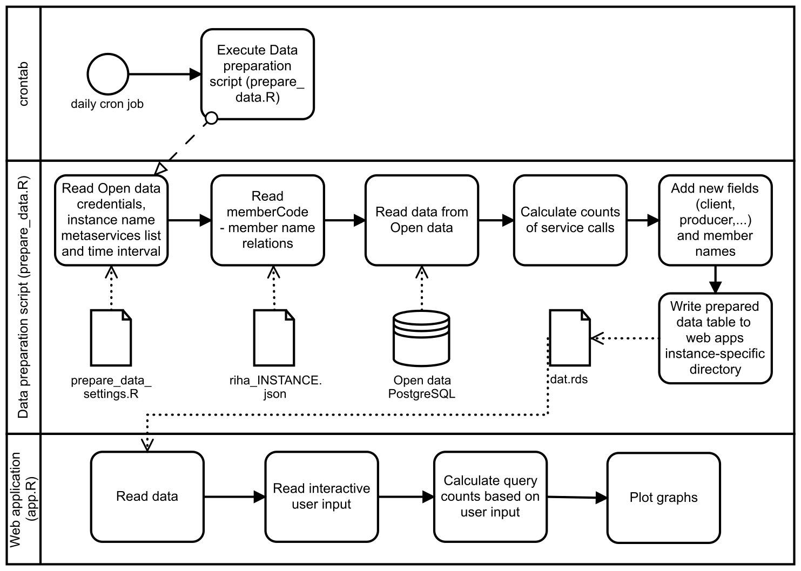

| [](https://www.ria.ee/en/) [](https://www.ria.ee/en/x-road.html) |  |
| :-------------------------------------------------- | -------------------------: |

# X-Road v6 monitor project - Networking / Visualizer Module

## About

The Networking module is part of [X-Road v6 monitor project](../README.md), which includes modules of [Database module](database_module.md), [Collector module](collector_module.md), [Corrector module](corrector_module.md), [Analysis module](analysis_module.md), [Reports module](reports_module.md), [Opendata module](opendata_module.md) and Networking/Visualizer module (this document).

The purpose of the **Networking module** is to visualize the networking activity between the X-Road members. It consists of:
 
1. **Data preparation** R script that queries the Open data PostgreSQL database, does relevant calculations (query counts between X-road members) and writes a table file to be used in the visualization web application;
2. RStudio Shiny-based **web application** to visualize the networking activity between the X-Road members.

Both components are scripted in the [R language] (https://www.r-project.org/about.html).

Overall system, its users and rights, processes and directories are designed in a way, that all modules can reside in one server (different users but in same group 'opmon') but also in separate servers.  

Overall system is also designed in a way, that allows to monitor data from different X-Road v6 instances (in Estonia `ee-dev`, `ee-test`, `EE`, see also [X-Road v6 environments](https://www.ria.ee/en/x-road-environments.html#v6).

Overall system is also designed in a way, that can be used by X-Road Centre for all X-Road members as well as for Member own monitoring (includes possibilities to monitor also members data exchange partners).

The module source code can be found at:

```
https://github.com/ria-ee/X-Road-opmonitor
```

and can be downloaded into server:

```bash
sudo su - networking
# If HOME not set, set it to /tmp default.
export TMP_DIR=${HOME:=/tmp}
export PROJECT="X-Road-opmonitor"
export PROJECT_URL="https://github.com/ria-ee/${PROJECT}.git"
export SOURCE="${TMP_DIR}/${PROJECT}"
if [ ! -d "${TMP_DIR}/${PROJECT}" ]; then \
    cd ${TMP_DIR}; git clone ${PROJECT_URL}; \
else \
  cd ${SOURCE}; git pull ${PROJECT_URL}; \
fi
```

## Processes flow chart

The general scheme of processes in the Networkin module is as follows:



## Data preparation script, overview

The **data preparation R script** `prepare_data.R` should be placed into the APPDIR directory within a subfolder named after the desired X-Road instance. In this manual, `/srv/app` is used as APPDIR and the `sample` is used as INSTANCE. To repeat for another instance, please change `sample` to map your desired instance.

```bash
export APPDIR="/srv/app"
export INSTANCE="sample"
```

The data preparation script `prepare_data.R` does the following: 

1. Read settings from file `prepare_data_settings.R` with the following information:
    * X-Road instance name
    * Time period to be used for data retrieval from Open data PostgreSQL database
    * List of metaservices
    * Open data PostgreSQL database connection configuration
2. Read instance specific complementary files `${APPDIR}/${INSTANCE}/riha_${INSTANCE}.json` in order to link `clientmembercode` and `servicemembercode` to the names of the X-Road members.
3. Establishes a connection to Open data PostgreSQL and queries the most recent date in field `requestindate`.
4. Queries the most recent data from Open data dating back to certain number of days ('interval' in settings file, default 30 days) from the most recent `requestindate`. The script retrieves only `succeeded=True` logs. The script retrieves the following fields:

    ```
    requestindate, clientmembercode, clientsubsystemcode, 
    servicemembercode, servicesubsystemcode, servicecode
    ```

5. Calculates the count of service calls between each unique combination of the fields:

    ```
    clientmembercode, clientsubsystemcode, servicemembercode, 
    servicesubsystemcode, servicecode
    ```

6. Adds the following concatenate fields `client`, `producer`, `producer.service` using newline escape sequence as a separator:

    ```
    client=paste(clientmembercode, clientsubsystemcode, sep='\n')
    producer=paste(servicemembercode, servicesubsystemcode, sep='\n')
    producer.service=paste(servicemembercode, servicesubsystemcode, servicecode, sep='\n')
    ```

7. Adds member names based on `riha_${INSTANCE}.json`
8. Writes the resulting table to RDS-file (R-specific binary file) in the folder where the visualization application resides (`/srv/shiny-server/${INSTANCE}/`)

The `prepare_data.R` is set up to run daily using Crontab.

The following parameters can be changed in settings (`prepare_data_settings.R`):

1. X-Road instance name
2. Time interval in days for which the data is queried (counting back from the most recent date available in the Open data PostgreSQL database field `requestindate`)
3. List of metaservices (services related to the X-road monitoring by the Information System Authority)
4. Open data PostgreSQL database connection credentials

There must be separate settings files for each X-Road instance folder. The `prepare_data_settings.R` can be edited in a regular text editor.

## Visualization web application

The visualization web application is based on [Rstudio Shiny Server Open Source platform] (https://www.rstudio.com/products/shiny/download-server/). It is an open source, free of charge software under a GNU Affero General Public License v3.

The visualization web application enables the end-user to get visually illustrated information on the networking activity between the X-Road members. User can:
 
1. Select to visualize all members or select one member.
2. Select a "Top n" threshold to show only service calls reaching the highest n count of queries.
3. Select the level of details with three options: member level, subsystem level, service level.
4. Select whether the X-road members are displayed as their registry codes or names.
5. Select whether to include metaservices (services related to the X-road monitoring by the Information System Authority).

The visualization output includes two different graphs:

1. The upper network graph shows members as circular nodes and arrows between the nodes to signify the connections between the members. Stronger color and thicker line indicates higher number of queries. The arrow points in a direction of client --> producer.
2. The lower heatmap-type graph shows the same information but in a different form. The members in a producer role are plotted on the horizontal axis while the members in a client role are plotted on the vertical axis. The intersections (colored cells) of members on the horizontal and vertical axes indicate the number of queries between the given X-Road members. Greener colors signify lower number of queries and red colors higher number of colors.

The numbers of queries between the members are logarithmed (log10) in both graphs in order to enable color and line thickness graduations.

The back-end of the web application is scripted in an R script `/srv/shiny-server/${INSTANCE}/app.R`. 
In addition to setting up the user interface, the script also does service call counting and logarithming. 
The data file prepared by `prepare_data.R` includes counts of service calls on the service level. 
For displaying X-road member networking on the higher levels (member, subsystem), the `app.R` script reactively sums the query counts.

## Installation

This sections describes the necessary steps to install the Networking module in a Linux Ubuntu 16.04.

### Install R, Rstudio Shiny Server Open Source and other software

R is needed in order to run the data preparation script and visualization web application. Rstudio Shiny Server Open Source is needed only for the visualization web application.

```bash
# install R
sudo echo "deb http://cran.rstudio.com/bin/linux/ubuntu xenial/" | sudo tee -a /etc/apt/sources.list.d/r.list
# Key source: https://cran.rstudio.com/bin/linux/ubuntu/
sudo apt-key adv --keyserver keyserver.ubuntu.com --recv-keys E084DAB9
gpg -a --export E084DAB9 | sudo apt-key add -
#
sudo apt-get update
sudo apt-get install r-base r-base-dev
# install R Shiny package
sudo su - \
    -c "R -e \"install.packages('shiny', repos='https://cran.rstudio.com/')\""
# install Rstudio Shiny Server Open Source using gdebi packages and dependencies installation manager
sudo apt-get install gdebi-core
# Download debian package
wget https://download3.rstudio.org/ubuntu-12.04/x86_64/shiny-server-1.5.5.872-amd64.deb
# Install
sudo gdebi shiny-server-1.5.5.872-amd64.deb
# Remove downloaded package
rm shiny-server-1.5.5.872-amd64.deb
```

Details of installing Shiny Server and information on current versions can be found [here](https://www.rstudio.com/products/shiny/download-server/). The example installation commands shown above are based on the current version 1.5.5.872 released 2017-09-25.

Shiny Server service starts running after installation. To check the status, start, stop and restart the service manually, use:

```bash
sudo service shiny-server status
sudo service shiny-server start
sudo service shiny-server stop
sudo service shiny-server restart
```

With default settings, the service will automatically start when the system boots. To enable or disable automatic start on boot use:

```bash
sudo systemctl enable shiny-server
sudo systemctl disable shiny-server
```

With default settings, Shiny install creates `/srv/shiny-server/index.html` (actually symbolic link to ~shiny-server/samples/welcome.html) to ensure it works. It is suggested to remove or replace with your own.

```bash
sudo rm /srv/shiny-server/index.html
sudo echo "Placeholder" > /srv/shiny-server/index.html
```

PostgreSQL is needed to be installed for enabling R to connect to the Open data PostgreSQL database:

```bash
sudo apt-get update
sudo apt-get install postgresql postgresql-contrib
sudo apt-get install libpq-dev
```

Install R packages and dependencies needed in the data preparation script and visualization web application:

```bash
sudo apt-get install build-essential
sudo apt-get install libxml2 libxml2-dev
sudo su - \
    -c "R -e \"install.packages('dplyr', repos='https://cran.rstudio.com/')\""
sudo su - \
    -c "R -e \"install.packages('shinycssloaders', repos='https://cran.rstudio.com/')\""
sudo su - \
    -c "R -e \"install.packages('ggplot2', repos='https://cran.rstudio.com/')\""
sudo su - \
    -c "R -e \"install.packages('igraph', repos='https://cran.rstudio.com/')\""
sudo su - \
    -c "R -e \"install.packages('qgraph', repos='https://cran.rstudio.com/')\""
sudo su - \
    -c "R -e \"install.packages('DBI', repos='https://cran.rstudio.com/')\""
sudo su - \
    -c "R -e \"install.packages('https://cran.r-project.org/src/contrib/Archive/RPostgreSQL/RPostgreSQL_0.4-1.tar.gz', repos=NULL, type='source')\""
sudo su - \
    -c "R -e \"install.packages('jsonlite', repos='https://cran.rstudio.com/')\""
```

### Install Networking module

The prerequisite of setting up the Networking module is that the Open data module is running and access to the PostgreSQL database is granted for the Networking module.

The Networking module uses the system user **networking** and group **opmon**. To create them, execute:

```bash
sudo useradd --base-dir /opt --create-home --system --shell /bin/bash --gid networking networking
sudo groupadd --force opmon
sudo usermod --append --groups opmon networking
```

#### Make necessary directories and correct necessary permissions:

```bash
# export APPDIR="/srv/app"; export INSTANCE="sample"
# Create log and heartbeat directories with group 'opmon' write permission
# export APPDIR="/srv/app"; export INSTANCE="sample"
sudo mkdir --parents ${APPDIR}/${INSTANCE}
sudo mkdir --parents ${APPDIR}/${INSTANCE}/logs
sudo mkdir --parents ${APPDIR}/${INSTANCE}/heartbeat
sudo chown root:opmon ${APPDIR}/${INSTANCE} ${APPDIR}/${INSTANCE}/logs ${APPDIR}/${INSTANCE}/heartbeat
sudo chmod g+w ${APPDIR}/${INSTANCE} ${APPDIR}/${INSTANCE}/logs ${APPDIR}/${INSTANCE}/heartbeat

sudo mkdir --parents ${APPDIR}/${INSTANCE}/networking_module
sudo chown networking:networking ${APPDIR}/${INSTANCE}/networking_module
```

#### Copy the **data preparation R script** and its settings file

The data preparation script `prepare_data.R` and its settings file `prepare_data_settings.R` are copied to X-Road instance-specific subfolder.

```bash
# export APPDIR="/srv/app"; export INSTANCE="sample"
sudo cp --preserve ${SOURCE}/networking_module/prepare_data.R ${APPDIR}/${INSTANCE}/networking_module
sudo cp --preserve ${SOURCE}/networking_module/prepare_data_settings.R ${APPDIR}/${INSTANCE}/networking_module
sudo chown --recursive networking:networking ${APPDIR}/${INSTANCE}/networking_module
```

##### Configure the data preparation R script settings file

Relevant X-Road instance-specific changes must be done in the settings file. A regular text editor can be used. 

```bash
# export APPDIR="/srv/app"; export INSTANCE="sample"
sudo vi ${APPDIR}/${INSTANCE}/networking_module/prepare_data_settings.R
```

There is a different settings file for each instance. 
An example of the settings used for instance `sample` is given below. 

**Note:** PostgreSQL doesn't allow dashes and case sensitivity comes with a hassle.
This means that for PostgreSQL instance it is suggested to use underscores and lower characters (usage: .format(INSTANCE.lower().replace('-', '_')).

In Estonia, X-Road instances `ee-dev`, `ee-test` and `EE` are in use. Therefor, following substitutions have to be made:
```
ee-dev -> ee_dev
ee-test -> ee_test
EE -> ee
```

Note that the Opendata PostgreSQL database credentials must have been granted beforehand. 
Open data PostgreSQL database password is not shown in this example.

```
# This is a Networking modules settings file. 
# Different settings file must be configured for each X-Road instance.

# The name of the X-Road instance.
instancename="sample"

# Time interval in days for which the data is queried.
interval=30

# Time buffer backward from the last date to enable data collection and correction.
buffer=10

# List of metaservices (services related to the X-road monitoring by the Information System Authority).
metaservices<-c("getWsdl", "listMethods", "allowedMethods", "getSecurityServerMetrics", "getSecurityServerOperationalData", "getSecurityServerHealthData")

# Open data PostgreSQL database credentials. 
host="opmon-opendata"
dbname="opendata_sample"
user="networking_sample"
port=5432
pwd=""
```

##### riha.json for member code - member name relations

The data preparation scripts need a file `riha_${INSTANCE}.json` (`riha_sample.json` in this example) that holds the member registry codes and member names. The file is produced within the [Collector module](collector_module.md) and needs to be in place (rsynced to) `${APPDIR}/${INSTANCE}` (`/srv/app/sample` in this example). See [Collector module](collector_module.md) section *The external files and additional scripts required for reports and networking modules* for more information about the `riha.json`.

#### Copy the **visualization web application R script**

The default location of the Shiny Server web application scripts is `/srv/shiny-server`. Each subfolder to this location can serve as a different web application given that the subfolder contains a proper application script named `app.R`. A path `/srv/shiny-server/${INSTANCE}/app.R` is automatically deployed to a web application that can be accessed at `http://localhost:3838/${INSTANCE}/`, e.g. a path `/srv/shiny-server/sample/app.R` translates to an application running at `http://localhost:3838/sample/` in the case of the current environment and `sample` X-Road instance. To host another X-Road instance web application, another subfolder must be created with the desired instance name and the `app.R` must be copied to that subfolder. There is no need to change the application script `app.R` because the structure and functioning remains the same for all instances. The application script `app.R` always reads data from the same folder where it resides. The instance-specific data preparation scripts `prepare_data.R` write the instance-specific data directly to the relevant `/srv/shiny-server/${INSTANCE}` folder.

The static files, e.g. logos in the heading of the web application, are kept in `/srv/shiny-server/${INSTANCE}/www` folder and this folder has to be copied as well.

```bash
# export INSTANCE="sample"
sudo mkdir --parents /srv/shiny-server/${INSTANCE}
sudo cp --preserve ${SOURCE}/networking_module/app.R /srv/shiny-server/${INSTANCE}
sudo cp --recursive --preserve ${SOURCE}/networking_module/www /srv/shiny-server/${INSTANCE}/www
sudo chown --recursive shiny:shiny /srv/shiny-server/${INSTANCE}
```

#### Run data preparation script

##### Crontab

It is advised to set up a daily crontab job to execute the data preparation script `prepare_data.R`. Different crontab jobs must be set up for different X-Road instances.

```bash
sudo crontab -e -u networking
# crontab entry, execution time at 04:00
0 4 * * * export APPDIR="/srv/app"; export INSTANCE="sample"; Rscript ${APPDIR}/${INSTANCE}/networking_module/prepare_data.R
```

##### Manual

For manual execution of data preparation script `prepare_data.R`, run

```bash
# export APPDIR="/srv/app"; export INSTANCE="sample"
Rscript ${APPDIR}/${INSTANCE}/networking_module/prepare_data.R
```

The data preparation script `prepare_data.R` writes a data file `dat.rds` into the Shiny Server web application folder `/srv/shiny-server/${INSTANCE}`. Given that the Shiny Server web application is running and all the previous steps have been successfully accomplished, the web application is now up and running at `http://localhost:3838/${INSTANCE}/`

## Logging 

### Data preparation script

The log files that are stored at `${APPDIR}/${INSTANCE}/networking_module/logs`. The local timestamp (YYYY-MM-DD hh:mm:ss), Unix timestamp, duration (hh:mm:ss), log information level (INFO, ERROR), activity and message are recorded in JSON structure:

```
{"module":"networking_module", "local_timestamp":"2017-11-16 20:32:16", "timestamp":1510857136, "duration":"00:00:01", "level":"INFO", "activity":"data preparation ended", "msg":"1 rows were written for visualizer."}
```

Heartbeat info is stored at `${APPDIR}/${INSTANCE}/networking_module/heartbeat`. Heartbeat has two statuses: SUCCEEDED and FAILED

```
{"module":"networking_module", "local_timestamp":"2017-11-16 20:32:16", "timestamp":1510857136, "msg":"SUCCEEDED"}
```

### Shiny Server

Rstudio Shiny Server Open Source has its own built-in logging. All information related to Shiny Server itself, rather than a particular Shiny application, is logged in the global system log stored in `/var/log/shiny-server.log`. Any errors and warnings that Shiny Server needs to communicate will be written here. The application-specific logs, in this case the applications residing in `/srv/shiny-server/` subfolders, are logged separately and stored in `/var/log/shiny-server`. The log files are created in the following format:
`<application directory name>-YYYMMDD-HHmmss-<port number or socket ID>.log`, e.g. `sample-shiny-20171021-232458-41093.log`.

A log file will be created for each R process when it is started. However, if a process closes successfully, the error log associated with that process will be automatically deleted. The only error log files that will remain on disk are those associated with R processes that did not exit as expected.
For more information on the Shiny Server server level logging, please see the [Server Log section of Shiny Server manual](http://docs.rstudio.com/shiny-server/#server-log).

For more information on the Shiny Server application level logging, please see the [Logging and Analytics section of Shiny Server manual](http://docs.rstudio.com/shiny-server/#logging-and-analytics).

## Link Shiny Server application with Google Analytics ID

Google Analytics ID can be added to Shiny web applications in Shiny Server configuration file `/etc/shiny-server/shiny-server.conf`. The following row must be added to the relevant application folder location `google_analytics_id "UA-12345-1"` (ID to be replaced by a correct one). Below in an example of the `shiny-server.conf` file with Google Analytics ID added to the default location of applications folder

```bash
# Instruct Shiny Server to run applications as the user "shiny"
run_as shiny;

# Define a server that listens on port 3838
server {
  listen 3838;

  # Define a location at the base URL
  # If you wish to serve under some other name, use sample
  # location /visualizer {
  location / {

    # Host the directory of Shiny Apps stored in this directory
    site_dir /srv/shiny-server;
    
    # Insert Google Analytics ID, sample
    # google_analytics_id "UA-12345-1";

    # Log all Shiny output to files in this directory
	log_dir /var/log/shiny-server;

    # When a user visits the base URL rather than a particular application,
	# an index of the applications available in this directory will be shown.
	# directory_index on;
	directory_index off;
  }
}
```

Restart Shiny Server service after changes:

```bash
sudo service shiny-server restart
```

For more information on how to use Google Analytics, including the method of how to set different Google Analytics IDs to different applications, please see the [3.5.3 Google Analytics section of Shiny Server manual](http://docs.rstudio.com/shiny-server/#google-analytics).

## Getting the riha_$instance.json files.

The files `${APPDIR}/${INSTANCE}/riha_${INSTANCE}.json` are currently being prepared by and synced from the ==> [Collector module](collector_module.md) <== via cron job using SCP/RSYNC.

## Possible optimization ideas

At of the current implementation, `prepare_data.R` queries data from Opendata PostgreSQL database time interval in 30 days (configurable `interval=30` in `${APPDIR}/${INSTANCE}/networking_module/prepare_data_settings.R` and prepares everything based of that. 
This might be memory-consuming. 
Basically, there are next options to optimize usage of RAM:

1. reduce interval
2. implement logic to fetch data only in one day interval and append it into `/srv/shiny-server/${INSTANCE}/dat.rds`
3. use R garbage collection utility gc() within `prepare_data.R` 