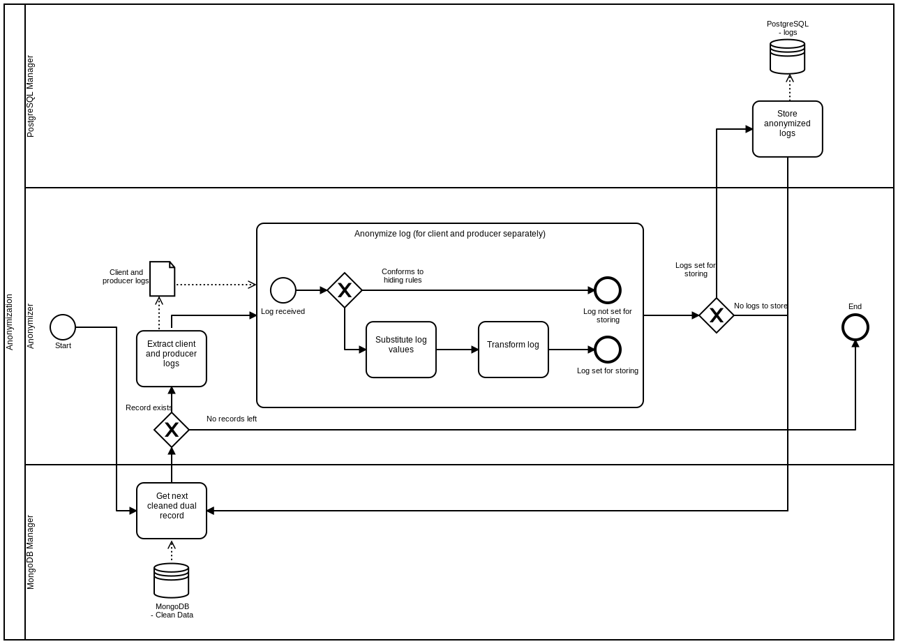

| [](https://www.ria.ee/en/) [](https://www.ria.ee/en/x-road.html) |  |
| :-------------------------------------------------- | -------------------------: |

# X-Road v6 monitor project - Open Data Module, Anonymizer Node

## About

Opendata module is part of [X-Road v6 monitor project](../../README.md), which includes modules of [Database module](../database_module.md), [Collector module](../collector_module.md), [Corrector module](../corrector_module.md), [Analysis module](../analysis_module.md), [Reports module](../reports_module.md), Opendata module (this document) and [Networking/Visualizer module](../networking_module.md).

**Anonymizer** is a pipeline for making X-Road v6 logs suitable for public use. It is achieved by fetching still unprocessed - but corrected data - from the [Corrector Module's](../corrector_module.md) output, applying the defined anonymization procedures, and outputting the already anonymized data available through [Interface and PostgreSQL Node](interface_postgresql.md).

### Anonymization process

1. Anonymizer requests records from MongoDB, of which *correctorStatus* is "done" and *correctorTime* is greater than the last anonymization session's timestamp.
2. Batches of `postgres['buffer_size']` records are distributed to the processing threads.
3. Unprocessed records (dual records with potential client and producer data) are split into individual
   client and producer logs.
4. Each individual log is then
	1. checked whether it should be ignored, using custom hiding rules from `settings.py`;
	2. having its individual values changed to constant values by the custom substitution rules
	   (for example set mime sizes to 0 if represented party code is X);
	3. transformed by custom transformers (Python functions). Custom transformers can perform more complicated or
	   "dynamic" value alterations (for example reducing timestamp precision);
	4. written to PostgreSQL database.
	


## Performance

The performance is tested on machine with Ubuntu 16.04.3, 4 GB of RAM and 1 CPU core with 1700 MHz.

The Anonymizer is only responsible for fetching raw dual logs from MongoDB, processing them (applying anonymization procedures), and sending them to PostgreSQL on a remote machine.

Elapsed time in format `H:MM:SS`

| Raw logs     | Threads    | Memory peak       | Batch size     | Elapsed time      |
| -----------: |-----------:|------------------:|----------------|------------------:|
| 1000         | 1          |                   | 1000           | 0:00:02           |
| 10000        | 1          |                   | 1000           | 0:00:10           |
| 100000       | 1          | 855 MB            | 1000           | 0:01:35           |
| 200000       | 1          | 1.7 GB            | 1000           | 0:03:20           |
| 500000       | 1          | 3.9 GB            | 1000           | 0:08:29           | 

## Codebase

The module source code can be found at:

```
https://github.com/ria-ee/X-Road-opmonitor
```

and can be downloaded into server:

```bash
sudo su - anonymizer
# If HOME not set, set it to /tmp default.
export TMP_DIR=${HOME:=/tmp}
export PROJECT="X-Road-opmonitor"
export PROJECT_URL="https://github.com/ria-ee/${PROJECT}.git"
export SOURCE="${TMP_DIR}/${PROJECT}"
if [ ! -d "${TMP_DIR}/${PROJECT}" ]; then \
    cd ${TMP_DIR}; git clone ${PROJECT_URL}; \
else \
  cd ${SOURCE}; git pull ${PROJECT_URL}; \
fi
```

## Networking

### Outgoing

- The anonymizer module needs access to the [Database_Module](../database_module.md).
- The anonymizer module needs access to the [Node 2: Interface and PostgreSQL](interface_postgresql.md) to push anonymized data for public use.

### Incoming

No **incoming** connection is needed in the anonymizer module.

## Installation

This sections describes the necessary steps to install the **anonymizer module** in a Linux Ubuntu 16.04. 
To a complete overview of different modules and machines, please refer to the [System Architecture](../system_architecture.md) and [Opendata module](../opendata_module.md) documentation.

### Installing Python libraries

Anonymizer has been written with Python 3.5.2 in mind, which is the default preinstalled _python3_ version for Ubuntu 16.04.3 LTS.

Get _pip3_ tool for downloading 3rd party Python libraries.

```bash
sudo apt-get --yes upgrade
sudo apt-get --yes install python3-pip
```

Install dependencies:

```bash
sudo pip3 install -r ${SOURCE}/opendata_module/anonymizer/requirements.txt
```

### Install anonymizer module

The anonymizer module uses the system user **anonymizer** and group **opmon**. To create them, execute:

```bash
sudo useradd --base-dir /opt --create-home --system --shell /bin/bash --gid anonymizer anonymizer
sudo groupadd --force opmon
sudo usermod --append --groups opmon anonymizer
```

The module files should be installed in the APPDIR directory, within a sub-folder named after the desired X-Road instance. 
In this manual, `/srv/app` is used as APPDIR and the `sample` is used as INSTANCE. 
To repeat for another instance, please change `sample` to map your desired instance.

```bash
export APPDIR="/srv/app"
export INSTANCE="sample"
```

Make necessary directories and correct necessary permissions:

```bash
# Create log and heartbeat directories with group 'opmon' write permission
# export APPDIR="/srv/app"; export INSTANCE="sample"
sudo mkdir --parents ${APPDIR}/${INSTANCE}
sudo mkdir --parents ${APPDIR}/${INSTANCE}/logs
sudo mkdir --parents ${APPDIR}/${INSTANCE}/heartbeat
sudo chown root:opmon ${APPDIR}/${INSTANCE} ${APPDIR}/${INSTANCE}/logs ${APPDIR}/${INSTANCE}/heartbeat
sudo chmod g+w ${APPDIR}/${INSTANCE} ${APPDIR}/${INSTANCE}/logs ${APPDIR}/${INSTANCE}/heartbeat
```

Copy the **anonymizer** code from temporary folder to the application folder and fix the file permissions:

```bash
# export APPDIR="/srv/app"; export INSTANCE="sample"
sudo cp --recursive --preserve \
    ${SOURCE}/opendata_module/anonymizer \
    ${APPDIR}/${INSTANCE}/opendata_module
```

Anonymizer module needs also a MongoDB database / collection `anonymizer_state_${INSTANCE}.state` to allow to store its last run's timestamp, where timestamp value is present in epoch timestamp forma in precision of milliseconds. Database is created on first run automatically.

```
_id: ObjectID('<hash>')
key: "last_mongodb_timestamp"
value: ""
```

Settings for different X-Road instances have been prepared and can be used:

```bash
# export APPDIR="/srv/app"; export INSTANCE="sample"
sudo rm --force ${APPDIR}/${INSTANCE}/opendata_module/anonymizer/settings.py
sudo ln --symbolic \
    ${APPDIR}/${INSTANCE}/opendata_module/anonymizer/instance_configurations/settings_${INSTANCE}.py \
	${APPDIR}/${INSTANCE}/opendata_module/anonymizer/settings.py
```

If needed, edit necessary modifications to the settings file using your favorite text editor (here, **vi** is used):

```bash
# export APPDIR="/srv/app"; export INSTANCE="sample"
sudo vi ${APPDIR}/${INSTANCE}/opendata_module/anonymizer/settings.py
```

Correct necessary permissions

```bash
# export APPDIR="/srv/app"; export INSTANCE="sample"
sudo chown --recursive anonymizer:anonymizer ${APPDIR}/${INSTANCE}/opendata_module/anonymizer
sudo chmod --recursive -x+X ${APPDIR}/${INSTANCE}/opendata_module/anonymizer
```

## Configuration

### Primary

The parameters must be tuned in the following relevant X-Road instance anonymizer settings:

```bash
# export APPDIR="/srv/app"; export INSTANCE="sample"
sudo vi ${APPDIR}/${INSTANCE}/opendata_module/anonymizer/settings.py
```

To get an "off-the-shelf" version running, one has to configure only the following parameters, given that no alterations
have been/will be done to MongoDB and PostgreSQL databases with respect to database and interface/postgresql
module's documentation. Otherwise user, database name, and port parameters along with anonymization patterns might need tuning.

```python
mongo_db['host_address']
mongo_db['password']
postgres['host_address']
postgres['password']
```

### Secondary

Other fine tuning parameters appearing in `settings.py` files are explained ==> [here](configuration_parameters.md) <==

#### Alter postgres table after redefining columns

Anonymizer doesn't offer automatic data table alteration system. If the Anonymizer's field translations file is changed during the production phase, then either the new one has to be calculated from the beginning or table alteration must be issued manually.

## Scheduling anonymization sessions

Anonymizer is meant to be run on regular basis. For that we use cron.

```bash
sudo crontab -e -u anonymizer
```

Add a cron job for relevant X-Road instance.

```
0 0 * * * export APPDIR="/srv/app"; export INSTANCE="sample"; cd ${APPDIR}/${INSTANCE}/opendata_module; /usr/bin/python3 -m anonymizer.anonymize
```

## Scaling

Main attribute: CPUs (can anonymize in parallel, number of threads must be defined in the settings).

Upscaling (more X-Road instances): additional CPUs and RAM to run Anonymizers in parallel.
Upscaling (more services): additional CPUs and RAM to process logs faster, as evey thread gets a batch of logs
to process.

Benefits from: fast connection to MongoDB and/or PostgreSQL.
_Doesn't store any data on disk (just enough to pull the application), communicates with MongoDB and PostgreSQL_.

## Logging and heartbeat

Anonymizer reads logging configuration from [logging.yaml](../../opendata_module/anonymizer/logging.yaml) and
writes logs to `${APPDIR}/${INSTANCE}/logs/anonymizer_${INSTANCE}.log`.
The path can be changed from an anonymizer's `settings.py` file. 

By default, Anonymizer uses TimedRotatingLogHandler to store daily logs for a week at INFO level. 
INFO level output contains the start and end info on an anonymization session.
Everything else is at ERROR level, as anonymization can't tolerate to fail at subtasks.

Anonymizer outputs heartbeat several times over a single anonymization session
to `${APPDIR}/${INSTANCE}/heartbeat/anonymizer_${INSTANCE}.json`.
This can be changed from an anonymizer's `settings.py` file. Heartbeat is in the following format:

```json
{"version": "0.0.1", "status": "alive", "name": "Anonymizer", "timestamp": "01-09-2017 13-35-35",
 "message": "Started anonymization session."}
```

**status:** *alive* or *dead*, depending on whether anonymization session succeeded or exited with an error.

## Test run

### Single session

Anonymizer instantiates the necessary classes responsible for fetching data, anonymizing it, and writing them to PostgreSQL database.

Anonymizer can take optional integer argument N, which anonymizes the first N (sample: 100) records from MongoDB.
Expect ~N..2*N records in PostgreSQL, as MongoDB stores producer and client records in clean_data collection together, PostgreSQL separately.

One session of anonymization is run by executing:

```bash
# export APPDIR="/srv/app"; export INSTANCE="sample"
cd ${APPDIR}/${INSTANCE}/opendata_module
sudo --user anonymizer python3 -m anonymizer.anonymize 100
```

After testing, remove the MongoDB database / collection `anonymizer_state_${INSTANCE}.state`, which acts as a last processing's timestamp bookmark.
If not removed, next call of anonymize.py will continue where the previous run left off.

Finally, drop the test table or data will be duplicated.

```bash
python3 ${APPDIR}/${INSTANCE}/opendata_module/anonymizer/tests/manual/drop_example_table.py
```

### Session data

The only value which is passed between any two consecutive anonymization sessions is the previous session timestamp.
It is stored in MongoDB database / collection `anonymizer_state_${INSTANCE}.state`. The next session processes all the data in the *clean_data* collection
within the range

```bash
(last processing timestamp, current [now] timestamp]
```

### Created PostgreSQL tables

After the first run with new *postgres* parameters, anonymizer creates  table `postgres['table_name']` (from _settings.py_) with fields derived from *field_data.yaml* and *field_translations.list* to store the anonymized logs.

### PostgreSQL indexes

Anonymizer does NOT create PostgreSQL indexes for created tables. To ensure Opendata Interface GUI and API functionalities to receive ordered data (order clauses), is recommended to create indexes for all given fields. It can be done by executing additional external script:

```bash
# export APPDIR="/srv/app"; export INSTANCE="sample"
cd ${APPDIR}/${INSTANCE}/opendata_module/anonymizer/external_files
sudo --user anonymizer python3 create_indices.py
```

It might happen, that indexes are broken during usage. Dropping / creating or reindexing might be needed.

```bash
sudo su - postgres
# $ postgres@opmon-opendata:~$ 
psql
# psql (9.5.10)
# Type "help" for help.
postgres=# \connect opendata_sample
# You are now connected to database "opendata_sample" as user "postgres".
opendata_sample=# REINDEX TABLE logs;
# REINDEX
opendata_sample=# \q
```


