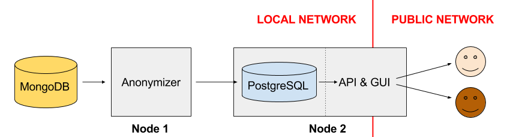

|   |  |
| :-------------------------------------------------- | -------------------------: |

# X-Road v6 monitor project - Opendata module

## About

Opendata module is part of [X-Road v6 monitor project](../README.md), which includes modules of [Database module](database_module.md), [Collector module](collector_module.md), [Corrector module](corrector_module.md), [Analysis module](analysis_module.md), [Reports module](reports_module.md), Opendata module (this document) and [Networking/Visualizer module](networking_module.md).

Overall system, its users and rights, processes and directories are designed in a way, that all modules can reside in one server (different users but in same group 'opmon') but also in separate servers.  

Overall system is also designed in a way, that allows to monitor data from different X-Road v6 instances (in Estonia `ee-dev`, `ee-test`, `EE`, see also [X-Road v6 environments](https://moodle.ria.ee/mod/page/view.php?id=700).

Overall system is also designed in a way, that can be used by X-Road Centre for all X-Road members as well as for Member own monitoring (includes possibilities to monitor also members data exchange partners).

## Architecture

Opendata module provides:

**Anonymizer** is a pipeline for making X-Road v6 logs suitable for public use. It is achieved by fetching still unprocessed - but corrected data - from the ==> [Corrector Module's](corrector_module.md) <== output, applying the defined anonymization procedures, and outputting the already anonymized data.

Anonymizer is on a machine without publicly accessible interface.

**Interface** is an API and a GUI to access the data already anonymized by Anonymizer.

Open Data Module's Interface (API and GUI) and PostgreSQL reside on a machine with public access.

It is important to note that it can take up to 7 days for the ==> [Collector module](collector_module.md) <== to receive X-Road v6 operational data from security server(s) and up to 3 days for the ==> [Corrector_module](corrector_module.md) <== to clean the raw data and derive monitoring metrics in a clean database collection.
This means that data is available in Opendata module at least 10 days after data received.

## Installation and configuration

The installation and configuration procedures along with test runs are described on the following pages (**Note:** Node 2 should be set up before, as Anonymizer depends on  a running PostgreSQL instance).

- [**Node 1: Anonymizer**](opendata/anonymizer.md)

- [**Node 2: Interface and PostgreSQL**](opendata/interface_postgresql.md)

## Opendata Interface documentation

Opendata provides a simple GUI to query daily anonymized logs and relevant metafeatures.  
User Guide can be found from ==> [here](opendata/user_guide/ug_opendata_interface.md) <==.

Opendata provides a simple API to query daily anonymized logs and relevant metafeatures.  
Documentation can be found from ==> [here](opendata/user_guide/ug_opendata_api.md) <==.

## Scaling over X-Road instances

Each X-Road instance will have it's own set of Anonymizer and Interface with PostgreSQL tables. 
X-Road instance INSTANCE will have its data anonymized by its dedicated Anonymizer process, anonymized data is stored in a dedicated PostgreSQL table, and Interface.

If there should be available opendata from 3 X-Road instances, then there should also be available 3 Anonymizer processes and 3 PostgreSQL tables storing the anonymized logs with 3 Interface applications running.

