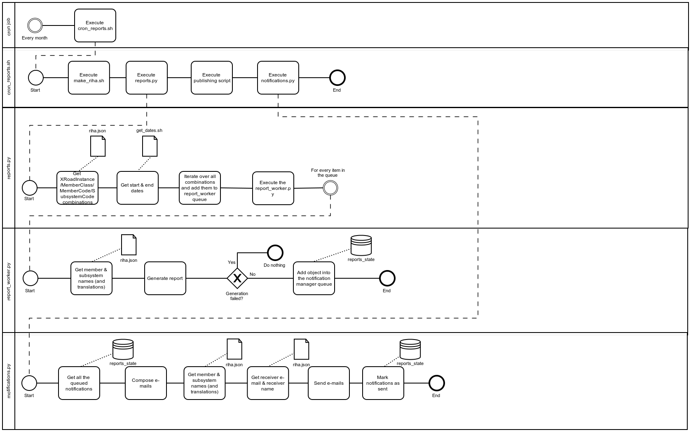
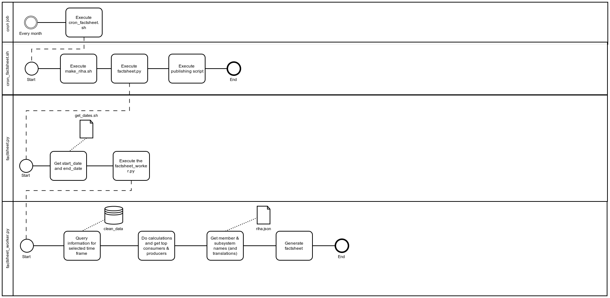
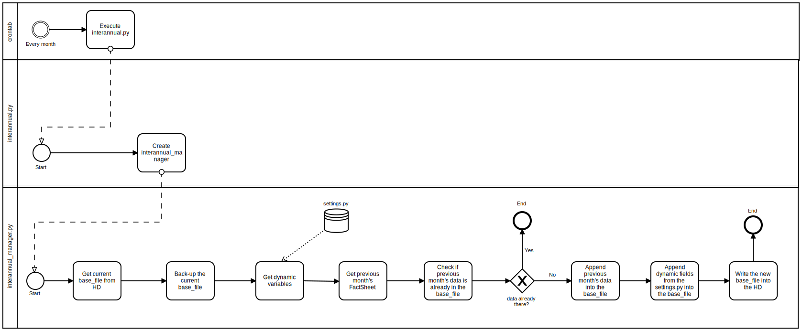

| [](https://www.ria.ee/en/) [](https://www.ria.ee/en/x-road.html) |  |
| :-------------------------------------------------- | -------------------------: |

# X-Road v6 monitor project - Reports Module

## About

The **Reports module** is part of [X-Road v6 monitor project](../README.md), which includes modules of [Database module](database_module.md), [Collector module](collector_module.md), [Corrector module](corrector_module.md), [Analysis module](analysis_module.md), Reports module (this document), [Opendata module](opendata_module.md) and [Networking/Visualizer module](networking_module.md).

The **Reports module** is responsible for creating different reports about X-Road v6 members subsystems (datasets usage).
The execution of the reports module can be either performed automatically (via **cron job**) or manually.

Overall system, its users and rights, processes and directories are designed in a way, that all modules can reside in one server (different users but in same group 'opmon') but also in separate servers.  

Overall system is also designed in a way, that allows to monitor data from different X-Road v6 instances (in Estonia `ee-dev`, `ee-test`, `EE`, see also [X-Road v6 environments](https://www.ria.ee/en/x-road-environments.html#v6).

Overall system is also designed in a way, that can be used by X-Road Centre for all X-Road members as well as for Member own monitoring (includes possibilities to monitor also members data exchange partners).

The module source code can be found at:

```
https://github.com/ria-ee/X-Road-opmonitor
```

and can be downloaded into server:

```bash
sudo su - reports
# If HOME not set, set it to /tmp default.
export TMP_DIR=${HOME:=/tmp}
export PROJECT="X-Road-opmonitor"
export PROJECT_URL="https://github.com/ria-ee/${PROJECT}.git"
export SOURCE="${TMP_DIR}/${PROJECT}"
if [ ! -d "${TMP_DIR}/${PROJECT}" ]; then \
    cd ${TMP_DIR}; git clone ${PROJECT_URL}; \
else \
  cd ${SOURCE}; git pull ${PROJECT_URL}; \
fi
```

## Diagram



## Networking

### Outgoing

- The reports module needs access to the Database Module (see ==> [Database_Module](database_module.md) <==).
- The reports module needs access to the X-Road Central Server (http, port 80).
- The reports module needs access to the reports public publishing server (via rsync or scp, port 22 (SSH)).
- The reports module needs access to the SMTP to announce member/subsystem contacts about reports created and published (port 25 (SMTP)).

### Incoming

No **incoming** connection is needed in the reports module.

## Installation

This sections describes the necessary steps to install the **reports module** in a Linux Ubuntu 16.04. 
To a complete overview of different modules and machines, please refer to the ==> [System Architecture](system_architecture.md) <== documentation.

### Install required packages

To install the necessary packages, execute the following commands in the terminal:

```bash
sudo apt-get update
sudo apt-get install python3-pip
sudo pip3 install pymongo==3.4.0
sudo apt-get install libfreetype6-dev
sudo pip3 install matplotlib==2.0.2
sudo pip3 install pandas==0.20.3
sudo pip3 install Jinja2==2.9.6
sudo apt-get install python3-dev python-lxml python-cffi libcairo2 \
    libpango1.0-0 libgdk-pixbuf2.0-0 libffi-dev shared-mime-info
sudo pip3 install WeasyPrint==0.39
sudo apt-get install libtiff5-dev libjpeg8-dev zlib1g-dev libfreetype6-dev \
    liblcms2-dev libwebp-dev tcl8.6-dev tk8.6-dev python3-tk
sudo pip3 install Pillow==4.2.1
sudo pip3 install tinycss==0.4
sudo pip3 install requests==2.14.2
```

Most libraries follow the "MAJOR.MINOR.PATCH" schema, so the guideline is to review and update PATCH versions always (they mostly contain bug fixes). MINOR updates can be applied,  as they should keep compatibility, but there is no guarantee for some libraries. A suggestion would be to check if tests are working after MINOR updates and rollback if they stop working. MAJOR updates should not be applied.

### Install reports module

The reports module uses the system user **reports** and group **opmon**.
Also, the user has to have ability to push generated reports into publishing server via rsync / scp. 
To allow this, ssh keys have to be exchanged.
To create group, user and exchange ssh keys, execute:

```bash
sudo useradd --base-dir /opt --create-home --system --shell /bin/bash --gid reports reports
sudo groupadd --force opmon
sudo usermod --append --groups opmon reports
```

Additionally, key-based, password-less accesses between modules are needed:

```bash
#
# Generate keys
sudo --user reports ssh-keygen -t rsa
#
# Set publishing user and publishing server values, also home directory in publishing server before usage
# Appending public key to a remote file via SSH
# Alternatively, administrative user might be used for that
#
# export publishing_user=""; export publishing_server=""
sudo --user reports /bin/cat ${HOME}/.ssh/id_rsa.pub | \
    ssh ${publishing_user}@${publishing_server} "/bin/cat >> ${HOME}/.ssh/authorized_keys"
```

The module files should be installed in the APPDIR directory, within a sub-folder named after the desired X-Road instance. 
In this manual, `/srv/app` is used as APPDIR and the `sample` is used as INSTANCE (please change `sample` to map your desired instance).

```bash
export APPDIR="/srv/app"
export INSTANCE="sample"
# Create log and heartbeat directories with group 'opmon' write permission
sudo mkdir --parents ${APPDIR}/${INSTANCE}
sudo mkdir --parents ${APPDIR}/${INSTANCE}/logs
sudo mkdir --parents ${APPDIR}/${INSTANCE}/heartbeat
sudo chown root:opmon ${APPDIR}/${INSTANCE} ${APPDIR}/${INSTANCE}/logs ${APPDIR}/${INSTANCE}/heartbeat
sudo chmod g+w ${APPDIR}/${INSTANCE} ${APPDIR}/${INSTANCE}/logs ${APPDIR}/${INSTANCE}/heartbeat
# Create directories for reports, factsheets and interannual factsheets
sudo mkdir --parents ${APPDIR}/${INSTANCE}/reports
sudo mkdir --parents ${APPDIR}/${INSTANCE}/factsheets
sudo mkdir --parents ${APPDIR}/${INSTANCE}/interannual_factsheet
# Directories reports/ and factsheets/ and interannual_factsheet are only for user reports
sudo chown reports:reports ${APPDIR}/${INSTANCE}/reports
sudo chown reports:reports ${APPDIR}/${INSTANCE}/factsheets
sudo chown reports:reports ${APPDIR}/${INSTANCE}/interannual_factsheet
```

Copy the **reports module** code to the install folder and fix the file permissions:

```bash
# export APPDIR="/srv/app"; export INSTANCE="sample"
sudo cp --recursive --preserve ${SOURCE}/reports_module ${APPDIR}/${INSTANCE}
```

## Usage of reports module

Reports module includes generation of two types of reports: monthly reports (about every memberCode / subsystemCode usage statistics) and Factsheet creation process.

It is important to note that it can take up to 7 days for the ==> [Collector module](collector_module.md) <== to receive X-Road v6 operational data from security server(s) and up to 3 days for the ==> [Corrector_module](corrector_module.md) <== to clean the raw data and derive monitoring metrics in a clean database collection.
This means that if monthly reports are to be generated, the cron job should run **after** the 7th day of the month (eg 10 days).

# Monthly Reports about memberCode / subsystemCode usage

## Configuration

Settings for different X-Road instances have been prepared and can be used:

```bash
# export APPDIR="/srv/app"; export INSTANCE="sample"
sudo rm ${APPDIR}/${INSTANCE}/reports_module/settings.py
sudo ln --symbolic \
    ${APPDIR}/${INSTANCE}/reports_module/settings_${INSTANCE}.py \
	${APPDIR}/${INSTANCE}/reports_module/settings.py
```

If needed, edit necessary modifications to the settings file using your favorite text editor (here, **vi** is used):

```bash
# export APPDIR="/srv/app"; export INSTANCE="sample"
sudo vi ${APPDIR}/${INSTANCE}/reports_module/settings.py
```

These are the settings that **must** be definitely set:

```python
MONGODB_USER = ""
MONGODB_PWD  = ""
MONGODB_SERVER = ""
MONGODB_SUFFIX = ""

# --------------------------------------------------------
# Configure general report settings
# --------------------------------------------------------
# Set publishing user and publishing server values, also home directory in publishing server before usage
reports_publishing_user = ""
reports_publishing_server = ""
reports_publishing_directory = ""
REPORTS_TARGET = "{0}@{1}:{2}/{3}/".format(reports_publishing_user, 
                                           reports_publishing_server, 
                                           reports_publishing_directory, 
                                           INSTANCE)

# --------------------------------------------------------
# Configure notifications
# --------------------------------------------------------
# e-mail from where the reports will be sent
SENDER_EMAIL = "yourname@yourdomain"
# the SMTP host used for sending reports
SMTP_HOST = 'smtp.yourdomain'
# the smtp port used for sending reports
SMTP_PORT = 25
```

These are the settings that will work with default values set but can be changed while needed:

```python
APPDIR = "/srv/app"
INSTANCE = "sample"
# Reports output directory
REPORTS_PATH = "{0}/{1}/reports/".format(APPDIR, INSTANCE)
```

Available languages for the reports are:

```
en - english
et - estonian
```

The relevant translation files are in the folder `reports_module/lang`.

## The external files and additional scripts required for reports module

### riha.json

External file `${APPDIR}/${INSTANCE}/reports_module/external_files/riha.json` is generated within ==> [Collector module](collector_module.md) <== because it has access to the necessary X-Road Central Server (or Security Server if needed) and is made available for Reports module through remote copying. 
It is required for:

1. generation list of possible reports, sub-module `reports_py`, get xRoadInstance/meberClass/memberCode/subSystemCode combinations
2. complement reports with member and sybsystem names and their translations in human-readable format, sub_module `report_worker.py`
3. sending out notifications, complement e-mail with member and sybsystem names and their translations in human-readable format, also getting receiver e-mail and name, sub_module `notifications.py`

Sample of `${APPDIR}/${INSTANCE}/reports_module/external_files/riha.json`

```json
[
  {
    "subsystem_code": "10000000-name",
    "x_road_instance": "XTEE-CI-XM",
    "member_class": "GOV",
    "subsystem_name": {
      "en": "Company Test X-Road v6 subsystem",
      "et": "Ettevõtte Test X-tee v6 alamsüsteem"
    },
    "member_code": "10000000",
    "email": [
      {
        "name": "Firstname Lastname",
        "email": "firstname.lastname@domain.com"
      }
    ],
    "member_name": "Company Test AS"
  }
]
```

### get_dates.sh

This script is needed to get start and end dates of previous month and needs to output the following: start_date(YYYY-MM-DD) end_date(YYYY-MM-DD)

For example: `2017-05-01 2017-05-31`

```bash
#!/bin/bash
TODAY=$(date '+%F') # or whatever YYYY-MM-DD you need
THIS_MONTH_START=$(date -d "$TODAY" '+%Y-%m-01')
LAST_MONTH_START=$(date -d "$THIS_MONTH_START -1 month" '+%F')
LAST_MONTH_END=$(date -d "$LAST_MONTH_START +1 month -1 day" '+%F')
echo $LAST_MONTH_START $LAST_MONTH_END
```

**NB!** There are two copies of this file available, one for reports module `REPORT_DATES_PATH = "reports_module/external_files/get_dates_reports.sh"` 
and another for the Factsheet `FACTSHEET_DATES_PATH = "reports_module/external_files/get_dates_factsheet.sh"`. 
Two copies are kept to allow modifying reports/factsheet generating timetable without disturbing another. 

## Correct necessary permissions

```bash
# export APPDIR="/srv/app"; export INSTANCE="sample"
sudo chown --recursive reports:reports ${APPDIR}/${INSTANCE}/reports_module
sudo chmod --recursive -x+X ${APPDIR}/${INSTANCE}/reports_module
find  ${APPDIR}/${INSTANCE}/reports_module/ -name '*.sh' -type f | sudo xargs chmod u+x
```

### Manual usage

Run the `report_worker.py` with `member_code`, `subsystem_code` (optional), `member_class`, `x_road_instance`, `start_date`, `end_date` and `language parameters`.
Here's an example of the script call WITH the subsystem_code:

```bash
# export APPDIR="/srv/app"; export INSTANCE="sample"
cd ${APPDIR}/${INSTANCE}
sudo --user reports /usr/bin/python3 -m reports_module.report_worker \
    --member_code 70006317 \
	--subsystem_code monitoring \
	--member_class GOV \
	--x_road_instance sample \
	--start_date 2017-5-1 \
	--end_date 2017-5-31 \
	--language et
```

Here's an example of the script call WITHOUT the `subystem_code` (generates report about when query logs did NOT include subsystem_code):

```bash
# export APPDIR="/srv/app"; export INSTANCE="sample"
cd ${APPDIR}/${INSTANCE}
sudo --user reports /usr/bin/python3 -m reports_module.report_worker \
    --member_code 70006317 \
	--member_class GOV \
	--x_road_instance sample \
	--start_date 2017-5-1 \
	--end_date 2017-5-31 \
	--language et
```

### CRON usage

CRON usage includes 4 steps:

1. Generate complementary data for reports from RIHA
2. Run reports
3. Publish reports
4. Run notification manager

Add **reports module** as a **cron job** to the **reports** user.

```bash
sudo crontab -u reports -e
```

The **cron job** entry (executes in 10th day of month 12:34:

```
34 12 10 * * export APPDIR="/srv/app"; export INSTANCE="sample"; cd ${APPDIR}/${INSTANCE}/reports_module; ./cron_reports.sh
```

**Note:** The prediction of 10th date comes from timeschedule:

- X-Road Security Servers keep operational monitoring data up to 7 days, during this timeframe it must collected by [Collector module](collector_module.md).
- We give extra 3 days to ensure all raw_messages are corrected, message pairs found, transferred into clean_data and marked as `{"correctorStatus": "done"}` by [Corrector module](corrector_module.md).

To check if the reports module is properly installed in the reports user, execute:

```bash
sudo crontab -u reports -l
```

## Result

Check the availability of generated report(s) at the reports folder:

```bash
# export APPDIR="/srv/app"; export INSTANCE="sample"
ls -l --recursive ${APPDIR}/${INSTANCE}/reports
```

The Report naming convention is the following: `memberCode_startDate_endDate_creationDate_creationTime.pdf`.
For example: subsystemCodeA_2017-05-01_2017-05-31_2017-06-10_12-34-56-123456.pdf

The "startDate", "endDate" & the "creationDate" have the following format: YYYY-MM-DD.
For example: 2017-05-31

The creationTime has the hour-minute-second-millisecond format: HH-mm-ss-MMMSSS.
For example: 12-34-56-123456

## Open reports / Factsheet

* Factsheet is generated based on the previous calendar month's usage statistics. The Factsheet is generated and extraced into a text file, which is in a JSON format.
* The Factsheet uses some of the reports module's logic/functionality (code), then it it is located inside the reports module folder as well. 
* The Factsheet shares Logger with memberCode / subSystemCode monthly reports, ie. the logging is done into the same file as for the reports (reports_module.settings -> LOGGER_PATH).
* The Factsheet naming convention is the following: `start_date_end_date_creation_time.txt` (Ex: `2017-5-1_2017-5-31_2017-6-10_12-34-56-123456.txt`)

### Diagram



### Configuration

```bash
# export APPDIR="/srv/app"; export INSTANCE="sample"
sudo vi ${APPDIR}/${INSTANCE}/reports_module/settings.py
```

The following settings are relevant for Factsheet generation:

```python
factsheet_username = "factsheet_{0}".format(INSTANCE)
# The number of top producers to have in the output file.
number_of_top_producers = 5
# The number of top consumers to have in the output file.
number_of_top_consumers = 5
# These member_code's will be excluded from the top_producers and top_consumers.
excluded_client_member_code = ["code_1", "code_2"]
# The path where the FactSheets will be generated.
FACTSHEET_PATH = "{0}/{1}/factsheets/".format(APPDIR, INSTANCE)
# The path where the dates will be taken for the FactSheet.
FACTSHEET_DATES_PATH = "reports_module/external_files/get_dates_factsheet.sh"
# Set publishing user and publishing server values, also home directory in publishing server before usage
factsheet_publishing_user = ""
factsheet_publishing_server = ""
factsheet_publishing_directory = ""
FACTSHEET_TARGET = "{0}@{1}:{2}/{3}/".format(factsheet_publishing_user, 
                                             factsheet_publishing_server, 
                                             factsheet_publishing_directory, 
                                             INSTANCE)
```

### Manual usage

Run the factsheet_worker.py with start_date(`YYYY-MM-DD`) and end_date(`YYYY-MM-DD`) parameters:

```bash
# export APPDIR="/srv/app"; export INSTANCE="sample"
cd ${APPDIR}/${INSTANCE}
sudo --user reports /usr/bin/python3 -m reports_module.factsheet_worker "2017-05-01" "2017-05-31"
```

Check the Factsheet at the factsheets folder:

```bash
# export APPDIR="/srv/app"; export INSTANCE="sample"
ls -l --all --recursive ${APPDIR}/${INSTANCE}/factsheets
```

### CRON usage

Set cron to run Factsheet every 10th day of month at 11 am:

```bash
sudo crontab -u reports -e
```

```
34 12 10 * * export APPDIR="/srv/app"; export INSTANCE="sample"; cd ${APPDIR}/${INSTANCE}/reports_module; ./cron_factsheet.sh
```

The FactSheet naming convention is the following: "startDate_endDate_creationDate_creationTime.txt".
For example: 2017-05-01_2017-05-31_2017-6-10_12-34-56-123456.txt

The "startDate", "endDate" & the "creationDate" have the following format: YYYY-MM-DD.
For example: 2017-05-01

The creationTime has the hour-minute-second-millisecond format: HH-mm-ss-MMMSSS.
For example: 12-34-56-123456

### Monitoring and Status

#### Logging 

The **reports module** produces log files that, by default, are stored at `${APPDIR}/${INSTANCE}/logs`

To change the logging level, it is necessary to change the logger.setLevel parameter in the settings file:

```python
# INFO - logs INFO & WARNING & ERROR
# WARNING - logs WARNING & ERROR
# ERROR - logs ERROR
logger.setLevel(logging.INFO)
```

The time format for durations in the log files is the following: "HH:MM:SS".
For example:

```
"Finished process. Processing time: 00:00:56"
```

## Interannual factsheet

* The purpose of the interannual factsheet is to combine the regular monthly factsheets into an interannual factsheet.
The interannual factsheet uses some of the reports module's logic/functionality (code), therefore it is located inside the reports module folder as well. 
* The interannual factsheet shares Logger with reports & Factsheets, ie. the logging is done into the same file as for the reports (reports_module.settings -> LOGGER_PATH).
* The interannual factsheet has the following name: 
```"data_v6.json"```
* The interannual factsheet is located in the following folder:
```${APPDIR}/${INSTANCE}/interannual_statistics/```
* Before each interannual factsheet generation a backup is generated within the same folder with the following naming:
```"data_v6.json.BAK"```


### Diagram


### Configuration

The `calc.js` file is used for displaying and calculating the data for the `https://www.ria.ee/x-tee/fact/` site.
The file has been configured in a way that it adds the query_counts from x-road v5 and x-road v6 together.
The data for v6 is generated by the interannual factsheet.
The data for v5 is maintained by the client. NB: The v5 file should be placed into the `settings.BASE_FILE_LOCATION` as well for syncing.
The file `calc.js` can be found at `reports_module/external_files/calc.js`.

```bash
# export APPDIR="/srv/app"; export INSTANCE="sample"
sudo vi ${APPDIR}/${INSTANCE}/reports_module/settings.py
```

The following settings are relevant for interannual factsheet generation:

```python
# "last_incident"
LAST_INCIDENT = "2001-12-17T18:25:43.511Z"
# "affected_parties"
AFFECTED_PARTIES = 52000
# "effective_query_proportion"
EFFECTIVE_QUERY_PROPORTION = 0.05
# "effective_query_minutes"
EFFECTIVE_QUERY_MINUTES = 15
# "protocol_changes"
PROTOCOL_CHANGES = 4
# Base file location
BASE_FILE_LOCATION = "{0}/{1}/interannual_factsheet/".format(APPDIR, INSTANCE)
# Base file name
BASE_FILE_NAME = "data_v6.json"
# Set publishing user and publishing server values, also home directory in publishing server before usage
interannual_factsheet_publishing_user = ""
interannual_factsheet_publishing_server = ""
interannual_factsheet_publishing_directory = ""
INTERANNUAL_FACTSHEET_TARGET = "{0}@{1}:{2}/{3}/".format(interannual_factsheet_publishing_user, 
                                                         interannual_factsheet_publishing_server, 
                                                         interannual_factsheet_publishing_directory, 
                                                         INSTANCE)
```

It is very important that the **base_file** is added into the BASE_FILE_LOCATION before running the interannual factsheet.
The **example** base file is located in the reports_module/external_files/data_v6.json.

### CRON usage

**Note:** this is suggested to run interannual factsheet right after monthly factsheet. 
In this case, one can use it in a way (run every 11th day of month at 12:34):

```bash
sudo crontab -u reports -e
```

```
34 12 11 * * export APPDIR="/srv/app"; export INSTANCE="sample"; cd ${APPDIR}/${INSTANCE}/reports_module; ./cron_interannual.sh
```

Or include them into the same cron job sequently (run every 10th day of month at 12:34):

```
34 12 10 * * export APPDIR="/srv/app"; export INSTANCE="sample"; cd ${APPDIR}/${INSTANCE}/reports_module; ./cron_factsheet.sh; ./cron_interannual.sh; 
```

### Monitoring and Status

#### Logging 

The **reports module** produces log files that, by default, are stored at `${APPDIR}/${INSTANCE}/logs`

To change the logging level, it is necessary to change the logger.setLevel parameter in the settings file:

```python
# INFO - logs INFO & WARNING & ERROR
# WARNING - logs WARNING & ERROR
# ERROR - logs ERROR
logger.setLevel(logging.INFO)
```

The time format for durations in the log files is the following: "HH:MM:SS".
For example:

```
"Finished process. Processing time: 00:01:23"
```

### Heartbeat

The Factsheet & Reports & Interannual factsheet all have a heartbeat.json file.
The settings (in the settings file) for the heartbeat files are the following:

```python
HEARTBEAT_LOGGER_PATH = '{0}/{1}/heartbeat/'.format(APPDIR, INSTANCE)
FACTSHEET_HEARTBEAT_NAME = "heartbeat_factsheet.json"
REPORT_HEARTBEAT_NAME = "heartbeat_report.json"
INTERANNUAL_HEARTBEAT_NAME = "heartbeat_interannual_factsheet.json"
```
So, for each MONGODB_SUFFIX (X-Road instance) a separate heartbeat will be generated.

The Reports module has a heartbeat.json file, by default, is stored at `${APPDIR}/${INSTANCE}/heartbeat`.

The heartbeat files consist of the following fields:

```
timestamp - the timestamp when the heartbeat was updated
module - module name
msg - message
version - version
status - status
```

The statuses used in the Reports and Factsheet generation in the heartbeat are the following:

```
"FAILED"
"SUCCEEDED"
```
