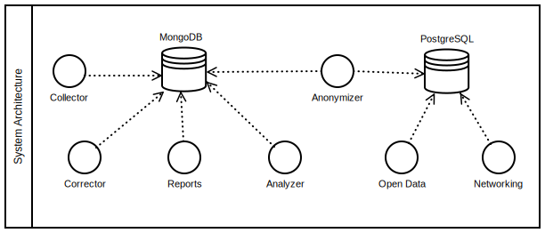

| [](https://www.ria.ee/en/) [](https://www.ria.ee/en/x-road.html) |  |
| :-------------------------------------------------- | -------------------------: |

# X-Road v6 monitor project - System Architecture

The system is distributed over 7 servers, organized as follows:

* [Database Module (MongoDB)](#database-module)
* [Collector Module](#collector-module)
* [Corrector Module](#corrector-module)
* [Reports Module](#reports-module)
* [Analyzer Module](#analyzer-module)
* [Opendata Module (on 2 nodes)](#opendata-module)
* [Networking/Visualizer Module](#networking-visualizer-module)

The System Architecture is part of [X-Road v6 monitor project](../README.md), which includes modules of [Database module](database_module.md), [Collector module](collector_module.md), [Corrector module](corrector_module.md), [Analysis module](analysis_module.md), [Reports module](reports_module.md), [Opendata module](opendata_module.md) and [Networking/Visualizer module](networking_module.md).

Overall system, its users and rights, processes and directories are designed in a way, that all modules can reside in one server (different users but in same group 'opmon') but also in separate servers. 

Overall system is also designed in a way, that allows to monitor data from different X-Road v6 instances (in Estonia `ee-dev`, `ee-test`, `EE`, see also [X-Road v6 environments](https://www.ria.ee/en/x-road-environments.html#v6).

Overall system is also designed in a way, that can be used by X-Road Centre for all X-Road members as well as for Member own monitoring (includes possibilities to monitor also members data exchange partners).




## Operational specifications, X-Road instance EE (production)

Expectations and limits below are calculated based on actual usage of X-Road v5 in Estonia. 
They might reviewed and updated according to future usage of X-Road v6 in Estonia.

Expectations below are valid for overall X-Road usage by all its member organizations.
Usage of X-Road in particular organization or hosted in particular hosting or X-Road security servers farm differs significantly, therefor other architecture, hardware and software might used to fulfill particular organization requirements.

### Data flow expectation

* It is expected to have maximum 1 billion (1 000 000 000) X-Road v6 service calls (queries) in production environment (Estonia: EE) in 1 year period
* Each query log might collected from both query partners (Client and Producer), id est maximum 2 billion (2 000 000 000) X-Road v6 service call logs in production environment in 1 year period. This means:
  * 165 000 000 logs per month
  * 40 000 000 logs per week
  * 5 500 000 logs per day
  * 230 000 logs per hour 
  * 60 000 logs per 15 minute
* Each of log records in JSON-format takes approximately 900 B (bytes).
* Each query log is uploaded into MongoDB as 'raw_messages' and after correction kept there as 'clean_data'. Raw messages are purged periodically. Alternatively, log might kept in Collector HDD as disk file and loaded into system from there.
* Each query log is published in PostgreSQL as open-data after anonymization.
    
### Database operational specifications

* MongoDB shall retain 1 year data in disk memory.
* MongoDB shall retain 1 week data in RAM memory for efficient query.
* MongoDB shall run in a replication set for availability.
* PostgreSQL shall retain 1 year of public available data.

### Modules operational specifications

* Collector: runs every 2 hours, collect recent data from security servers and stores them in Database (or alternatively in HDD and then into Database).
* Corrector: runs continuously as a service, use recent data in MongoDB.
* Analyzer: runs every hour, uses MongoDB and local cache in disk.
* Report creator: runs monthly, uses MongoDB, stores reports in disk, publish them on public server and sends out notifications about reports available.
* Open Data Module: runs every day, uses MongoDB recent data, uses PostgreSQL as main database.
* Networking Module: runs every day, uses last 30 days data from Opendata PostgresSQL, produces X-Road networking diagram with R Shiny.

## Database Module

The Database Module is responsible to store queries data using MongoDB. 
It uses the following configuration:

```
Host: opmon
```

### Data objects

Estimated size for 1 year documents (1 billion X-Road v6 service calls (queries)):

| Collection Name | Documents     | Avg.Document Size (B) | Total Document Size (GB) | Num.Indexes | Total Index Size (GB) |
|-----------------|---------------|-----------------------|--------------------------|-------------|-----------------------|
| raw_messages    | 2,000,000,000 | 900	                  | 1,500                    | 6           | 170                   |
| clean_data      | 1,400,000,000 | 2000                  | 2,500                    | 44          | 530                   |
| **TOTAL**       | **3,400,000,000** |                       | **4,000**                    |             | **700**                   |


**Note**: index size depends on indexes set up and use.

### Hardware Specification

```
* 32 GB RAM per Node
* 5 TB storage (RAID-0 or RAID-10)
* 4 CPU
* Minimum 1 Node, Recommended 3 Nodes for redundancy
* Scalability: Addition of Nodes (8 nodes to support 1 week data in RAM in 2021)
```

### Software Specification

```
* Ubuntu LTS 16.04 with EXT4 or XFS
* MongoDB 3.4
```

Please note about warnings and recommendations of MongoDB:

```
# mongo admin --username root --password
STORAGE  [initandlisten] ** WARNING: Using the XFS filesystem is strongly recommended with the WiredTiger storage engine
STORAGE  [initandlisten] **          See http://dochub.mongodb.org/core/prodnotes-filesystem
CONTROL  [initandlisten]
CONTROL  [initandlisten] ** WARNING: /sys/kernel/mm/transparent_hugepage/enabled is 'always'.
CONTROL  [initandlisten] **        We suggest setting it to 'never'
CONTROL  [initandlisten]
CONTROL  [initandlisten] ** WARNING: /sys/kernel/mm/transparent_hugepage/defrag is 'always'.
CONTROL  [initandlisten] **        We suggest setting it to 'never'
```

### Network Specification

```
* port 27017 (default)
* allow access from: collector IP, corrector IP, analyzer IP, reports IP, opendata anonymizer IP
```

Read more about ==> [Database module](database_module.md) <==.

## Collector Module

The Collector Module is responsible for querying servers and storing the data into MongoDB database.
It uses the following configuration: 

```
Host: opmon-collector
System User: collector
# export APPDIR="/srv/app"; export INSTANCE="sample" # X-Road instances in Estonia: 'ee-dev' or 'ee-test' or 'EE'
Path: ${APPDIR]/${INSTANCE}/collector_module
```

### Hardware Specification

```
* 2 GB RAM
* 10 GB storage
* 2 CPU
```

### Software Specification

```
* Ubuntu LTS 16.04 with EXT4 or XFS
* Python 3.5
```

### Network Specification

```
* allow access to: X-Road central server port 80, monitoring security server port 80
* allow access to: opmon:27017 (default, MongoDB)
```

Read more about ==> [Collector module](collector_module.md) <==.

## Corrector Module

The Corrector Module is responsible for transforming the raw data in MongoDB to cleaning data.
It uses the following configuration: 

```
Host: opmon-corrector
System User: corrector
# export APPDIR="/srv/app"; export INSTANCE="sample" # X-Road instances in Estonia: 'ee-dev' or 'ee-test' or 'EE'
Path: ${APPDIR]/${INSTANCE}/corrector_module
```

### Data objects

The corrector module stores in RAM query documents during duplication removal and client-producer pair matching. The amount of used memory is estimated to:

* 60 MB of RAM memory for 20k batch messages. 

### Hardware Specification

```
* 8 GB RAM
* 10 GB storage
* 4 CPU
```

### Software Specification

```
* Ubuntu LTS 16.04 with EXT4 or XFS
* Python 3.5
```

### Network Specification

```
* allow access to: opmon:27017 (default, MongoDB)
```

Read more about ==> [Corrector module](corrector_module.md) <==.

## Reports Module

The Reports Module is responsible to generate periodical reports, accordingly to user configuration.
It uses the following configuration: 

```
Host: opmon-reports
System User: reports
# export APPDIR="/srv/app"; export INSTANCE="sample" # X-Road instances in Estonia: 'ee-dev' or 'ee-test' or 'EE'
Path: ${APPDIR]/${INSTANCE}/reports_module
```

### Data objects

The reports module loads in memory query data for the time period considered in the report. For 1 month of data, a maximum of 10 millions queries are considered for one subsystem code. The amount of used memory is estimated to:

* 30 GB for 10M messages in a report.

### Hardware Specification

```
* 16 GB RAM
* 10 GB storage
* 2 CPU
```

### Software Specification

```
* Ubuntu LTS 16.04 with EXT4 or XFS
* Python 3.5
```

### Network Specification

```
* allow access to: opmon:27017 (default, MongoDB)
* allow access to: public web:22 (scp, rsync)
* allow access to: smtp:25 (email)
```

Read more about ==> [Reports module](reports_module.md) <==.

## Opendata Module

Components: Anonymizer, Opendata UI, Opendata API

### Node 1 - Anonymizer

```
Host: opmon-anonymizer
System User: anonymizer
# export APPDIR="/srv/app"; export INSTANCE="sample" # X-Road instances in Estonia: 'ee-dev' or 'ee-test' or 'EE'
Path: ${APPDIR]/${INSTANCE}/opendata_module/anonymizer
```

#### Hardware Specification

```
* 4 GB RAM
* 10 GB storage
* 2 CPU
```

#### Software Specification

```
* Ubuntu LTS 16.04 with EXT4 or XFS
* Python 3.5
```

#### Network Specification

```
* allow access to: opmon:27017 (default, MongoDB)
* allow access to: opmon-opendata:5432 (default, PostgreSQL)
```

### Node 2 - PostgreSQL, Interface and API 

```
Host: opmon-opendata
System User: opendata
# export APPDIR="/srv/app"; export INSTANCE="sample" # X-Road instances in Estonia: 'ee-dev' or 'ee-test' or 'EE'
Path: ${APPDIR]/${INSTANCE}/opendata_module/interface
```

#### Hardware Specification

```
* 32 GB RAM
* 5 TB storage ( ~30 TB in 2021)
* 4 CPU
```

#### Software Specification

```
* Ubuntu LTS 16.04 with EXT4 or XFS
* Python 3.5
* PostgreSQL
```

#### Network Specification

```
* allow access from: 0.0.0.0/0:80 (public, http)
* allow access from: 0.0.0.0/0:443 (public, https)
```
Read more about ==> [Opendata module](opendata_module.md) <==.

## Analyzer Module

Components: Analyzer, Analyzer UI

```
Host: opmon-analyzer
System User: analyzer
# export APPDIR="/srv/app"; export INSTANCE="sample" # X-Road instances in Estonia: 'ee-dev' or 'ee-test' or 'EE'
Path: ${APPDIR]/${INSTANCE}/analyzer_module
```

### Data objects

The analyzer module uses MongoDB aggregation functions and therefore has a relatively small memory footprint. The memory usage is dependent of number of X-Road services. The amount of used memory is estimated to: 250 MB for 1 000 X-Road service call logs.

### Hardware Specification

```
* 32 GB RAM
* 10 GB storage
* 4 CPU
```

### Software Specification

```
* Ubuntu LTS 16.04 with EXT4 or XFS
* Python 3.5
```

### Network Specification

```
* allow access to: opmon:27017 (default, MongoDB)
* allow access from: internal administrative network:80 (private, http)
```

Read more about ==> [Analysis module](analysis_module.md) <==.

## Networking/Visualizer Module

Components: Data preparation script, Visualization web application

```
Host: opmon-networking
System User: networking
# export APPDIR="/srv/app"; export INSTANCE="sample" # X-Road instances in Estonia: 'ee-dev' or 'ee-test' or 'EE'
Path: ${APPDIR]/${INSTANCE}/networking_module
```

### Hardware Specification

```
* 8 GB RAM
* 1 GB storage
* 2 CPU
```

### Software Specification

```
* Ubuntu LTS 16.04 with EXT4 or XFS
* R 3.4
* RStudio Shiny Server v1.5
```

Read more about ==> [Networking/Visualizer module](networking_module.md) <==.
