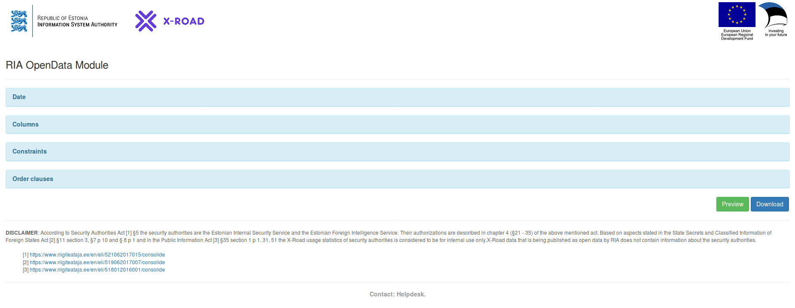
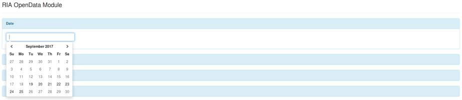

| [](https://www.ria.ee/en.html) [](https://www.ria.ee/en/state-information-system/x-tee.html) |  |
| :-------------------------------------------------- | -------------------------: |

# X-Road v6 monitor project - Open Data Interface Test

## Setup

Once the Interface is set up as instructed in Open Data Node 2 installation instructions ==> [here](../opendata/interface_postgresql.md) <==, let's temporarily modify the `settings.py` and populate the dynamically created `logs` table in the `opendata_ci_test` database, which was created in [Node 2's PostgreSQL section](../opendata/interface_postgresql.md#postgresql).

### Modify _settings.py_

**Note:** Since `interface_${INSTANCE}` user has no write permissions in `opendata_${INSTANCE}` database, the populating script has to use the `opendata_ci_test` database. To do that, the _POSTGRES_CONFIG_ `database_name`, `user`, and `password` parameters have to be temporarily changed in `settings.py`.

```bash
export WEBDIR="/var/www"; export INSTANCE="sample"
sudo echo "POSTGRES_CONFIG['database_name'] = 'opendata_ci_test'" \
    >> ${WEBDIR}/${INSTANCE}/opendata_module/interface/interface/settings.py
sudo echo "POSTGRES_CONFIG['user'] = 'ci_test'" \
    >> ${WEBDIR}/${INSTANCE}/opendata_module/interface/interface/settings.py
sudo echo "POSTGRES_CONFIG['password'] = 'ci_test'" \
    >> ${WEBDIR}/${INSTANCE}/opendata_module/interface/interface/settings.py
```

Reload Django with new settings:

```bash
sudo service apache2 reload
```

### Populate _opendata_ci_test_ database

```python
# export WEBDIR="/var/www"; export INSTANCE="sample"
python3 ${WEBDIR}/${INSTANCE}/opendata_module/interface/tests/manual/create_example_table.py
```

This script loads 100 predefined development logs into the `logs` table.

### Validation

#### Initial page

After navigating to `http://opmon-opendata/sample/gui`, we should see the following page:



#### Date constraint

Click on the **Date** section and it should show 



The dataset has data only from September 19, 2017 to September 25, 2017. Those should be the only selectable dates.

After selecting September 19 and clicking on the green "Preview" button, we should see both of the entries from the day:


#### Column constraints

When we change the date to September 20, 2017 and select "id", "messageid", and "totalDuration"


 
after clicking "Preview" again, we should see
 


#### Value and order constraints

When ignoring entries with "None" value and requesting only entries with "id" greater than 10 and ordering by ascending "totalDuration"


we should see:


#### Downloading

When clicking on "Download" instead of "Preview", the browser should initiate a "2017-09-20@download_timestamp.tar.gz" file download. The contents should look similar to


### Input Validation

Input validation is covered by integration tests, as connectivity to the PsotgreSQL database is already tested.

####  Test case 1: Validating input date field

Description: The purpose of this test is to verify that the validation of  an arbitrary date value is correct.

Integration tests:

* /opendata_module/interface/tests/test_input_validation.py::TestDateValidation::test_empty
* /opendata_module/interface/tests/test_input_validation.py::TestDateValidation::test_wrong_format
* /opendata_module/interface/tests/test_input_validation.py::TestDateValidation::test_too_recent
* /opendata_module/interface/tests/test_input_validation.py::TestDateValidation::test_loading

#### Test case 2: Validating input columns field

Description: The purpose of this test is to verify that the validation of  an arbitrary columns value is correct.

Integration tests:

* /opendata_module/interface/tests/test_input_validation.py::TestColumnsValidation::test_no_columns
* /opendata_module/interface/tests/test_input_validation.py::TestColumnsValidation::test_non_existent_columns
* /opendata_module/interface/tests/test_input_validation.py::TestColumnsValidation::test_wrong_format
* /opendata_module/interface/tests/test_input_validation.py::TestColumnsValidation::test_loading

#### Test case 3: Validating input order clauses field

Description: The purpose of this test is to verify that the validation of  an arbitrary order clauses value is correct.

Integration tests:

* /opendata_module/interface/tests/test_input_validation.py::TestOrderValidation::test_no_order
* /opendata_module/interface/tests/test_input_validation.py::TestOrderValidation::test_wrong_format
* /opendata_module/interface/tests/test_input_validation.py::TestOrderValidation::test_wrong_inner_datatypes
* /opendata_module/interface/tests/test_input_validation.py::TestOrderValidation::test_missing_attribute
* /opendata_module/interface/tests/test_input_validation.py::TestOrderValidation::test_non_existent_columns
* /opendata_module/interface/tests/test_input_validation.py::TestOrderValidation::test_non_existent_orders
* /opendata_module/interface/tests/test_input_validation.py::TestOrderValidation::test_loading

#### Test case 4: Validating input constraints field

Description: The purpose of this test is to verify that the validation of  an arbitrary constraints value is correct.

Integration tests:

* /opendata_module/interface/tests/test_input_validation.py::TestConstraintsValidation::test_no_constraints
* /opendata_module/interface/tests/test_input_validation.py::TestConstraintsValidation::test_wrong_format
* /opendata_module/interface/tests/test_input_validation.py::TestConstraintsValidation::test_missing_attribute
* /opendata_module/interface/tests/test_input_validation.py::TestConstraintsValidation::test_non_existent_columns
* /opendata_module/interface/tests/test_input_validation.py::TestConstraintsValidation::test_non_existent_operators
* /opendata_module/interface/tests/test_input_validation.py::TestConstraintsValidation::test_loading


### Finally

Drop the example `logs` table.

```python
# export WEBDIR="/var/www"; export INSTANCE="sample"
python3 ${WEBDIR}/${INSTANCE}/opendata_module/interface/tests/manual/drop_example_table.py
```

Undo the changes to the `settings.py`.

```bash
# export WEBDIR="/var/www"; export INSTANCE="sample"
sudo vi ${WEBDIR}/${INSTANCE}/opendata_module/interface/interface/settings.py
```

Alternative way to remove last 3 lines of POSTGRE test configuration added earlier is to  use commands below.

**Note:** Redirecting `tee` output to dev null to prevent displaying the whole `settings.py` content in the terminal.

```bash
# export WEBDIR="/var/www"; export INSTANCE="sample"
head --lines -3 ${WEBDIR}/${INSTANCE}/opendata_module/interface/interface/settings.py | \
    sudo tee ${WEBDIR}/${INSTANCE}/opendata_module/interface/interface/settings.py > /dev/null
```

Reload Django with current settings:

```bash
sudo service apache2 reload
```