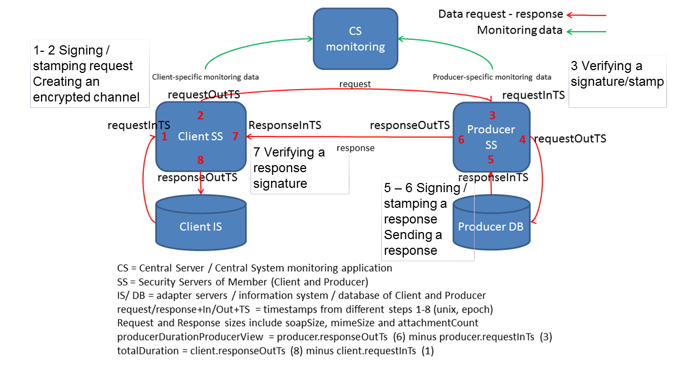

| [](https://www.ria.ee/et/) [](https://www.ria.ee/et/x-road.html) |  |
| :-------------------------------------------------- | -------------------------: |

# X-tee v6 monitooring - raportite lugemisjuhend

## Üldist

Raportid on mõeldud eelkõige isikutele, kes on märgitud [RIHAs](https://www.riha.ee/) vastava alamsüsteemi kontaktisikuteks (infosüsteemi ülematele).

Raportid võiksid anda neile ülevaate, mis üldse toimub X-teel Teie vastavas alamsüsteemis: 
- kes ja kui palju seda kasutab (Osutatud teenused) ning 
- kas ja kui palju Teie alamsüsteemist päringuid teistesse alamsüsteemidesse välja läheb (Kasutatud teenused). 

Mõlemad neist osadest on veel omakorda jagatud kaheks, eraldi nn „päris-teenused“ (äriteenused) ja X-tee metateenused. Kõigis neljas tabelis on toodud päringute kaupa (Teenus) nende kasutajad (Klient/Osutaja), õnnestunud ja ebaõnnestunud päringute arvud, samuti õnnestunud päringute kestused (millisekundites) ning päringute ja vastuste suurused (baitides).

Usume, et raportitest on kasu ka oma klientidest või andmevahetuspartneritest parema ülevaate saamisel.
Raportid võiksid oma andmetes anda ülevaate enim kasutatud, kõige vigasemate, kõige kauem kestvate või kõige kiiremate, samuti kõige mahukamate päringute kohta ning olla abiks teenuste paremal disainimisel ning kasutamisel, mahuhinnangutes.

Igal raportil on unikaalne nimeosa (koostamise hetk tuhandiksekundi täpsusega) ja avaldamiskeskkonnas olevate raporti kohta saadetakse e-postiga vaid viide.
Avaldamiskeskkonnas on kaustapuude kaudu kõigi seal asuvate raportite vaatamine piiratud. Kokkuvõttes võiksid need enam-vähem tagada, et: 
-	iga kontaktisik näeb just talle saadetud raportit;
-	mitte keegi ei näe teistele isikutele saadetud raporteid (ühe alamsüsteemi raport selle alamsüsteemi kontaktidele on muidugi seesama);
-	asutuse uus kontaktisik ei näe vanu raporteid ilma, et kas eelmine (või olemasolev) kontakt talle neid viiteid jagaks;
-	asutusest lahkunud kontaktisik ei saa enam teavitust uute koostatud raportite kohta.

Raportid koostatakse nii arendus- (ee-dev), test- (ee-test) kui toodangukeskkonna (EE) kohta iga kalendrikuu 8-10. kuupäeval.

Juhul kui on soovitusi raporti sisu, vormi jms osas, palun lahkesti teada anda, püüame RIA poolt kaasa aidata parema selguse ja läbipaistvuse loomisele selles, mis X-tee peal tegelikult toimub. Palun andke märku aadressil help@ria.ee kõikides seotud küsimustes.

Visualiseeritud pilt X-tee v6 toimuva kohta on:
- toodangukeskkonna (EE) kohta aadressil https://logs.x-road.ee/visualizer/EE
- testkeskkonna (ee-test) kohta aadressil https://logs.x-road.ee/visualizer/ee-test ja 
- arenduskeskkonna (ee-dev) kohta aadressil https://logs.x-road.ee/visualizer/ee-dev

## Korduma Kippuvad Küsimused

### Miks just MINA selle raporti sain?

Sest just Teie olete selle X-tee alamsüsteemi kontakt [RIHA](https://www.riha.ee/) andmetel. 
Palun veenduge RIHA andmete ajakohasuses (vajalik autentimine).

### Miks just TEMA selle raporti sai?

Sest just tema on selle X-tee alamsüsteemi kontakt [RIHA](https://www.riha.ee/) andmetel. 
Palun veenduge RIHA andmete ajakohasuses (vajalik autentimine).

### Kas ma võin mulle saadetud raporti edasi saata?

Jah, loomulikult! 
Need on andmed Teie X-tee alamsüsteemi kohta ja just Teie teate ise, kellele ja miks neid vaja võib olla.

### Liiga palju raporteid!

**Küsimus: Mõni meie inimene, kes rohkemate teenuste juures kontaktiks, sai neid kümnetega. Kas saaks teha ka miski koondi, kus kõik koos – st üks teavitus ja kõik raportid ühes kohas?**

Raporteid koostatakse ja saadetakse iga X-tee keskkonna iga alamsüsteemi kontaktile täpselt üks.
Raportite genereerimise loogika muutmine nii, et koostatavate raportite nimekiri tehakse kontaktisikute kaupa vajab hoopis teistsugust lähenemist ja ei ole hetke raamistikus võimalik.

Soovitame üle vaadata RIHAs iga alamsüsteemi kontaktisikud ning otsustada, kas on vajalik just selline jaotus alamsüsteemideks ja/või kas on vajalik, et üks isik on kõigi alamsüsteemide kontaktiks.

### Raportis on valed andmed!

**Küsimus: Raportist selgub, et teenust T on tarbitud X korda. Meie andmetel aga peaks päringute arv olema oluliselt suurem. Miks need ei kajastu raportis?**

Raportite koostamise aluseks on X-tee keskusele (RIA) kättesaadavad andmed liikmete X-tee turvaserveritest. Juhul kui ühel või teisel põhjusel ei ole Teie turvaserver kättesaadav, siis koostatakse Teie raporti andmed Teie andmevahetuspartnerite X-tee turvaserveritest pärineva põhjal. On võimalik, et ka osa nendest ei ole olnud kättesaadavad.

### Misasi on, kuidas on arvutatud kestus?

Päringute kestused fikseeritakse ja kajastatakse raportis kliendipoolelt vaadatuna, st leitakse aeg Teie turvaserveri poolt infosüsteemile / lõppkasutajale tagastatud vastuse hetke ning Teie infosüsteemi / lõppkasutaja poolt tehtud päringu hetk vahena (Client ResponseOutTs - Client RequestInTs).
Kestus on esitatud millisekundites.
Juhul kui andmeid Teie turvaserveris pole / ei saa, siis ei saa me neid ka raportis kajastada (on kajastatud kui `None`)

Lisatud ülevaatlik pilt, mis hetkede kellaajad eri andmevahetuspartnerite turvaserverites fikseeritakse ja mida arvutusteks kasutame.



**Päringu kestus kliendi (lõppkasutaja) vaates**

X-tee päringu kestus kliendi (lõppkasutaja) vaates arvutatakse X-tee kliendi rollis oleva liikme alamsüsteemi teenindavas turvaserveris fikseeritud kliendi turvaserve-rist kliendi infosüsteemile vastuse saatmise aja (8) ning kliendi infosüsteemi poolt algatatud päringu kliendi turvaserverisse jõudmise aja (1) vahena.

```
totalDuration = Client responseOutTs (8) - Client requestInTs (1)
```

**Päringu kestus teenusepakkuja vaates**

X-tee päringu kestus teenusepakkuja turvaserveri vaates arvutatakse X-tee teenusepakkuja rollis oleva liikme alamsüsteemi teenindavas turvaserveris fikseeritud teenusepakkuja turvaserverist kliendi turvaserverisse vastuse saatmise aja (6) ning kliendi turvaserverist teenusepakkuja turvaserverisse saadetud päringu kohale jõudmise aja (3) vahena.

```
producerDurationProducerView = Producer responseOutTs (6) - Producer requestInTs (3)
```

### Kas saab paremat raportit?

**Küsimus: Saadud raport top 5 teenuse kohta jääb mõne süsteemi osas ikka tiba väheseks, pigem võiks terviklik statistikaraport olla. Kas ja kust ja millal saab?**

Tõsi, ühte raportisse on keeruline mahutada kogu X-teel toimuvat. Palun täpsustage oma soovi terviklikkuse osas. Oleme valmis koostama põhjendatud soovi korral kas muutma või juurde lisama raportite malle, valmistama neid mingil teisel, just Teile sobivaimal kujul. 

**Küsimus: Saadetud raportist pole kuigi suurt abi, et selle baasil midagi hinnata saaks. Kui üldse, siis peaks olema monitooringusüsteemile loodud konto ligipääs, mis võimaldaks seal ise teha vajaduse põhiseid analüütilisi päringuid nn enda IS teenuste osas nii ajalises kui kasutuse mõttes.**

Eraldi liikmetele mõeldud ja kontohaldusega monitooringusüsteemi (*data warehouse*) RIA-l plaanis avada pole.

Raporti koostamise aluseks olev andmestik on kättesaadav ka Teie X-tee turvaserverist ning Teie andmevahetuspartneri turvaserveri(te)st. Heameelega nõustame, mil viisil saate seda ise koondada ning ise koostada endale vajalik raport.

Raporti koostamise aluseks olev andmestik on üldjoontes kättesaadav ka avaandmetena:
- Toodangukeskkonna `EE` avaandmed on avaldatud aadressil https://logs.x-road.ee/EE/gui/, 
- testkeskkonna `ee-test`omad aadressil https://logs.x-road.ee/ee-test/gui/ ja 
- arenduskeskkonna `ee-dev` omad aadressil https://logs.x-road.ee/ee-dev/gui/. 

### Kuidas Te seda infot kogute? 

Andmete saamiseks turvaserveritest kasutame X-tee teenuste monitooringut, selle dokumentatsioon on leitav Githubist, https://github.com/ria-ee/X-Road/tree/develop/doc/OperationalMonitoring.
Spetsiifilisemalt kasutame selleks kasutusstatistika andmed turvaserverist, päring `getSecurityServerOperationalData`. 
Päringu näidiseid ja valik võimalikke skripte on toodud ka Githubi süsteemitestide kaustas https://github.com/ria-ee/X-Road/tree/develop/src/systemtest/op-monitoring

Kogu andmestik on kogutud ilma päringute sisu privaatsust puudutamata.

### Kas X-tee päringud käivad ikka veel läbi keskserverite?

Läbi RIA keskserveri ei käi mitte mingit X-tee tegelikku liiklust, ei ole kunagi käinud ja ei hakka ka tulevikus käima. X-tee võimaldab turvalist ja hajutatud andmevahetust teenuse kasutaja ja teenuse osutaja vahel, puudub keskne koht.

### Mis monitooringu vahendiga üldse tegu on?

Pikem ja põhjalikum kirjeldus koos paigaldusjuhendite ja lähtekoodiga on avaldatud Githubi repositooriumis https://github.com/ria-ee/X-Road-opmonitor

Tööd telliti riigihanke RHR 183990 alusel, teostaja [Tarkvara Tehnoloogia Arenduskeskus OÜ (STACC)](https://www.stacc.ee/). 
Tõenäoliselt saab ka nendelt abi juhul kui otsustate teha just Teile sobiva süsteemi.

## Tehnilist

Monitooringuandmete saamiseks Teie X-tee v6 turvaserverist palun veenduge, et:
- kasutusel on uusim versioon (ver 6.16, https://x-road.eu/packages/ , arendus- ja testkeskkond https://x-road.eu/.test/packages/)
- tulemüür lubab X-tee päringuid RIA monitooringusüsteemist EE IP 195.80.123.159 (ee-dev IP 195.80.123.169, ee-test IP 195.80.123.164)

Tagamaks turvaserveri tarkvara pakettide korrektset paigaldumist, palume v6 turvaserveri uuendusi paigaldada alati käsuga (vaata ka https://github.com/ria-ee/X-Road/blob/develop/doc/Manuals/ig-ss_x-road_v6_security_server_installation_guide.md#45-different-versions-of-xroad--packages-after-successful-upgrade )

```
apt-get update
apt-get dist-upgrade
```

Pärast uuendust veenduge, et teenuste monitooringu pakid on paigaldatud.

X-tee turvaserverite administraatorite korduma kippuvad küsimused (KKK) ja vastused neile - https://moodle.ria.ee/mod/page/view.php?id=419

